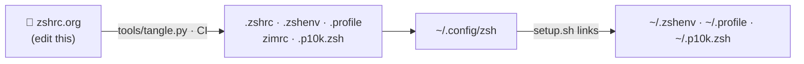

<h1 align="center">🦖 Rex Shell 2026</h1>
<p align="center"><b>Zim + Powerlevel10k, written as one Org file.</b><br>
Neon prompt · distro/CPU-aware segments · incognito history · optional-deps tolerant</p>

<p align="center">
  <a href="https://github.com/rexackermann/shell/actions/workflows/build.yml"></a>
  
  
  
  
  <a href="LICENSE"></a>
  
</p>

<p align="center"><code>v28</code> · 5,016 lines · 85 code blocks · 120 functions · 90 aliases</p>

> GitHub's Org renderer is down at the moment, so this README is **generated from
> [`zshrc.org`](zshrc.org)** by CI on every push. The sections below are that file, collapsed.

## ⚡ Install

```bash
bash -c "$(curl -fsSL https://raw.githubusercontent.com/rexackermann/shell/main/setup.sh)"
```

Clones to `~/.config/zsh` and links `~/.zshenv`, `~/.profile` and `~/.p10k.zsh`.
Zim and Powerlevel10k install themselves on first start.

## 🧭 How it fits together



| Path | Purpose |
|---|---|
| [`zshrc.org`](zshrc.org) | Source of truth. Edit this. |
| `.zshrc` `.zshenv` `.profile` `zimrc` `.p10k.zsh` `home.zshenv` | Generated from the org file |
| [`tools/tangle.py`](tools/tangle.py) | Emacs-free tangler (`--check` runs `zsh -n`) |
| [`bin/`](bin) | Helper scripts, on `PATH` |
| [`setup.sh`](setup.sh) | Installer |
| [`archive/`](archive) | Previous org, installer and sync script |

## 📚 The config

Click a section to expand it.

<details>
<summary><h3>00 · Early Zsh environment</h3></summary>

### User ~/.zshenv

This tiny bootstrap must exist before any global interactive \`zshrc\` can run. On Termux, Debian-like systems, and other distributions that initialize completion globally, it asks the global startup code to leave completion to this configuration. Completion itself is initialized explicitly later, after the completion function path has been assembled. The main Zsh configuration remains under \`\$ZDOTDIR\`.

``` shell

# Keep the actual configuration under XDG while making the setting available
# early enough for the system/global zshrc.
export ZDOTDIR="$HOME/.config/zsh"
skip_global_compinit=1
export skip_global_compinit

# When this file is the active $ZDOTDIR/.zshenv, the next file is already the
# one Zsh is reading and this source is harmlessly skipped by the path check.
if [[ "$ZDOTDIR/.zshenv" != "$HOME/.zshenv" && -r "$ZDOTDIR/.zshenv" ]]; then
  source "$ZDOTDIR/.zshenv"
fi

```

### \$ZDOTDIR/.zshenv

The XDG-local copy is intentionally tiny: this is the file Zsh reads directly when \`ZDOTDIR=\$HOME/.config/zsh\` is already exported by the launcher.

``` shell

# Point Zsh at this directory so it loads $ZDOTDIR/.zshrc.
export ZDOTDIR="$HOME/.config/zsh"

# This configuration owns completion initialization. Ask Termux/global
# startup code not to initialize compinit before our completion stack.
skip_global_compinit=1
export skip_global_compinit

```

### ~/.profile

Login-shell environment (XDG layout, toolchain homes, PATH additions). Generated from this file to \`~/.config/zsh/.profile\` and symlinked to \`~/.profile\` by \`setup.sh\`. \`GNUPGHOME\` deliberately lives under \`\$XDG<sub>DATAHOME</sub>\`, outside this repository.

``` shell

export XDG_DATA_HOME=$HOME/.local/share
export XDG_CONFIG_HOME=$HOME/.config
export XDG_STATE_HOME=$HOME/.local/state
export XDG_CACHE_HOME=$HOME/.cache

export GNUPGHOME="$XDG_DATA_HOME"/gnupg
export CARGO_HOME="$XDG_DATA_HOME"/cargo
export GOPATH="$XDG_DATA_HOME"/go
export GTK2_RC_FILES="$XDG_CONFIG_HOME"/gtk-2.0/gtkrc
export XCURSOR_PATH=/usr/share/icons:$XDG_DATA_HOME/icons
export KDEHOME="$XDG_CONFIG_HOME"/kde
export LESSHISTFILE="$XDG_STATE_HOME"/less/history
export ICEAUTHORITY="$XDG_CACHE_HOME"/ICEauthority
export MPLAYER_HOME="$XDG_CONFIG_HOME"/mplayer
export NODE_REPL_HISTORY="$XDG_DATA_HOME"/node_repl_history
export NVM_DIR="$XDG_DATA_HOME"/nvm
export PYTHONSTARTUP="/etc/python/pythonrc"
export RUSTUP_HOME="$XDG_DATA_HOME"/rustup
export WINEPREFIX="$XDG_DATA_HOME"/wine
export _Z_DATA="$XDG_DATA_HOME/z"
export SSB_HOME="$XDG_DATA_HOME"/zoom
[ -f "$XDG_CONFIG_HOME"/zsh/history ] && export HISTFILE="$XDG_STATE_HOME"/zsh/history || export HISTFILE="$HOME"/.zsh_history
export ZDOTDIR="$HOME"/.config/zsh
export LIBVA_DRIVER_NAME=iHD
export PATH="$HOME/.nimble/bin:$PATH"

[ -f "${HOME}/.gdrive-downloader/gdl" ] && [ -x "${HOME}/.gdrive-downloader/gdl" ] && PATH="${HOME}/.gdrive-downloader:${PATH}"

export PATH=$HOME/.yarn/bin:$PATH

export DENO_INSTALL="$HOME/.deno"
export PATH="$DENO_INSTALL/bin:$PATH"

# python pakages
export PATH="$HOME/.local/bin:$PATH"

# doom emacs
export PATH="$HOME/.emacs.d/bin:$PATH"
export PATH="$HOME/.config/emacs/bin:$PATH"
export PATH="$HOME/.config/.emacs/bin:$PATH"

export PATH="$HOME/shell/bin:$PATH"
export PATH="$HOME/.config/zsh/bin:$PATH"
export PATH="$HOME/.local/share/cargo/bin:$PATH"

# messed up ones maybe ?
export PATH="$HOME/.config/bin:$PATH"
export PATH="$HOME/.config/scripts:$PATH"
export GTK_IM_MODULE=ibus
export XMODIFIERS=@im=ibus
export QT_IM_MODULE=ibus
export XIM_PROGRAM="/usr/bin/ibus-daemon -drx"
[ -r "${CARGO_HOME:-$HOME/.local/share/cargo}/env" ] && . "${CARGO_HOME:-$HOME/.local/share/cargo}/env"

```

</details>

<details>
<summary><h3>01 · Bootstrap & environment</h3></summary>

### Install

One-command install for the existing bootstrap entrypoint:

``` shell

# Opt-in installer entrypoint. Nothing is downloaded or executed at shell startup.
rex-shell-remote-install() {
  emulate -L zsh
  (( $+commands[curl] )) || {
    print -u2 -- 'rex-shell-remote-install: curl is required'
    return 127
  }
  local url='https://raw.githubusercontent.com/rexackermann/shell/main/setup.sh'
  print -r -- "This will download and run: $url"
  print -r -- "Review it first: curl -fsSL $url | less"
  read -q "REPLY?Continue? [y/N] " || { print; return 1 }
  print
  command bash -c "$(command curl -fsSL -- "$url")"
}
```

### About this configuration

This is a single Org/Babel source of truth for a modular Zsh environment. The generated runtime is deliberately split into small managed layers:

- ****Zim Framework**** owns plugin/module installation, updates, initialization, and the static startup bundle.
- ****Powerlevel10k**** owns the visual prompt and contextual three-line HUD.
- ****mise**** owns project/runtime activation where installed.
- ****mise****, ****zoxide****, ****Atuin****, ****fzf****, ****eza****, ****bat****, ****delta****, ****difftastic****, ****lazygit****, ****fastfetch****, ****chafa****, ****btop****, and optional ****Yazi**** provide focused modern CLI capabilities when installed.
- The existing personal functions, aliases, integrations, Android/Termux helpers, media tools, and private configuration remain in this source.

The configuration is intentionally machine-specific. Review paths and commands before reusing it elsewhere.

### Dependency policy & fallbacks

Everything outside the Zsh language/runtime itself is treated as an optional capability. Nothing in this source should make the shell fail merely because an optional executable, plugin, runtime manager, or visual helper is absent. Components are detected first; the normal/default Zsh or platform tool is used when a nicer replacement is unavailable.

``` example
CAPABILITY / DEPENDENCY        PREFERRED                 FALLBACK / BEHAVIOUR
────────────────────────────────────────────────────────────────────────────────
Zim Framework                   Zim                       native Zsh startup path
Powerlevel10k                   P10k                      native compact prompt
zsh-completions                 extra completion defs     built-in Zsh completion
fzf-tab + fzf                   fuzzy completion UI      Zsh menu-select completion
Carapace                        broad CLI specs          native specs + --help parser
F-Sy-H                         syntax highlighting       optional; no hard failure
zsh-autosuggestions            history suggestions      optional; no hard failure
history-substring-search       substring Up/Down         native history widgets
Atuin                           Ctrl-R history UI        native history search
mise                            runtime/tool manager      NVM/RVM if present; else system
NVM                             legacy Node manager       loaded only if nvm.sh exists
RVM                             legacy Ruby manager       loaded only if rvm script exists
zoxide                         directory jumper          ordinary cd
exa/eza                        rich ls                   system ls
bat                             rich cat/pager            system cat / less
fzf                             fuzzy selector            Zsh select / direct editor fallback
delta                           Git pager                 Git default pager
Difftastic                      structural diff           regular git diff
lazygit                         Git TUI                   no lg alias; normal git remains
yazi                            terminal file manager     openfzf / normal shell tools
fastfetch                       system summary            uname/hostname summary
kitty/chafa/tiv                 image preview              no image preview if none exist
btop                            process UI                top/ps
kubectl                         Kubernetes integration    omitted entirely if absent
terraform/tofu                  IaC prompt                 omitted if absent
aws/az/gcloud/nix               cloud/tool prompt          omitted if absent
task/taskwarrior-tui            task UI                    omitted if absent
qrencode / Python qrcode         terminal QR                no QR helper if absent
pdftk                            PDF merge/bookmarks        helper omitted if absent
openssl + tar                    encrypted archive          helper omitted if absent
mpv                              media playback             helper omitted if absent
kitty/chafa/tiv                  wallpaper/image preview   preview helper omitted if absent
wmctrl                           fullscreen helpers         aliases omitted if absent
emacsclient                      Emacs client               alias omitted if absent
gdown / vidir                    download/file rename       aliases omitted if absent
svn / musikcube / sdcv           optional personal tools    aliases omitted if absent
ssh / mplayer / glances          optional personal tools    aliases omitted if absent
python3/python + argcomplete     pipx completion            integration omitted if absent
termux-wake-lock / sshd          Android shell extras       each action gated independently

The dependency table is documentation only: optional commands are never required
for startup. Each capability block either gates itself on the real executable or
provides a native/default fallback.
qrencode                        QR rendering              Python qrcode if available; otherwise omitted
mimeopen/xdg-open/open          file opener                platform-native opener if available
pipx + argcomplete              pipx completion            omitted if unavailable
glow                            glow completion             omitted if unavailable
rsync                           rsync helpers              helpers omitted if unavailable
tar + openssl                   encryptdir                 helper omitted if prerequisites absent

NO STARTUP DOWNLOADS:
- Optional packages/plugins are not fetched just because they are missing.
- Zim/P10k bootstrap is opt-in. An existing installation is used when present.
- NVM/RVM are lazy compatibility layers only when their real entrypoints exist.
- Legacy framework components replaced by the modern stack are not silently
  reinstalled.

Microsoft Inshellisense remains intentionally opt-in because it owns terminal
input handling and would overlap with the completion layers above.
```

### XDG paths

``` bash

export XDG_DATA_HOME="${XDG_DATA_HOME:-$HOME/.local/share}"
export XDG_CONFIG_HOME="${XDG_CONFIG_HOME:-$HOME/.config}"
export XDG_STATE_HOME="${XDG_STATE_HOME:-$HOME/.local/state}"
export XDG_CACHE_HOME="${XDG_CACHE_HOME:-$HOME/.cache}"

export ZDOTDIR="${ZDOTDIR:-$XDG_CONFIG_HOME/zsh}"

export GNUPGHOME="$XDG_DATA_HOME/gnupg"
export CARGO_HOME="$XDG_DATA_HOME/cargo"
export GOPATH="$XDG_DATA_HOME/go"
export GTK2_RC_FILES="$XDG_CONFIG_HOME/gtk-2.0/gtkrc"
export XCURSOR_PATH="/usr/share/icons:$XDG_DATA_HOME/icons"
export KDEHOME="$XDG_CONFIG_HOME/kde"
export LESSHISTFILE="$XDG_STATE_HOME/less/history"
export ICEAUTHORITY="$XDG_CACHE_HOME/ICEauthority"
export MPLAYER_HOME="$XDG_CONFIG_HOME/mplayer"
export NODE_REPL_HISTORY="$XDG_DATA_HOME/node_repl_history"
export DENO_INSTALL="${DENO_INSTALL:-$HOME/.deno}"
export NVM_DIR="$XDG_DATA_HOME/nvm"
export PYTHONSTARTUP="${PYTHONSTARTUP:-/etc/python/pythonrc}"
export RUSTUP_HOME="$XDG_DATA_HOME/rustup"
export WINEPREFIX="$XDG_DATA_HOME/wine"
export SSB_HOME="$XDG_DATA_HOME/zoom"
export ZO_DATA_DIR="$XDG_DATA_HOME/zoxide"

export ZIM_HOME="${ZIM_HOME:-$XDG_DATA_HOME/zim}"
export ZIM_CONFIG_FILE="${ZIM_CONFIG_FILE:-$ZDOTDIR/zimrc}"

# Canonical history location: keep the original XDG config path exactly.
export HISTFILE="$XDG_CONFIG_HOME/zsh/history"
mkdir -p "${HISTFILE:h}"

export HISTSIZE=1000000000
export SAVEHIST=$HISTSIZE
setopt EXTENDED_HISTORY
setopt APPEND_HISTORY

typeset -U path PATH
path=(
  "$HOME/.nimble/bin"
  "$HOME/.local/bin"
  "$HOME/.config/bin"
  "$HOME/.config/zsh/bin"
  "$HOME/.config/zsh/.bin"
  "$HOME/.cargo/bin"
  "$HOME/.config/emacs/bin"
  "$HOME/.config/.emacs/bin"
  "$HOME/.emacs.d/bin"
  "$HOME/shell/bin"
  "$GOPATH/bin"
  "$DENO_INSTALL/bin"
  "$HOME/.yarn/bin"
  $path
)
[[ -d /home/linuxbrew/.linuxbrew/bin ]] && path=(/home/linuxbrew/.linuxbrew/bin $path)
[[ -d /data/data/com.termux/files/usr/bin ]] && path=(/data/data/com.termux/files/usr/bin $path)
[[ -d /data/data/com.termux/files/home/.local/share/go/bin ]] && path=(/data/data/com.termux/files/home/.local/share/go/bin $path)
[[ -d /data/data/com.termux/files/home/.config/zsh/bin ]] && path=(/data/data/com.termux/files/home/.config/zsh/bin $path)
export PATH

fpath+=("${ZDOTDIR:-$HOME/.config/zsh}/.zsh_functions")

export LIBVA_DRIVER_NAME="iHD"
export ANDROID_HOME="$XDG_DATA_HOME/android"
```

### Tmux

``` shell

# Deliberately opt-in. The old auto-attach code is preserved as a reference,
# but this configuration will not silently move an interactive shell into tmux.
# if command -v tmux >/dev/null 2>&1 && [[ -o interactive ]] && [[ -z $TMUX ]]; then
#   exec tmux new -AD -t main
# fi

```

</details>

<details>
<summary><h3>02 · Zim framework & prompt</h3></summary>

### Zim configuration

``` shell

# -----------------------------------------------------------------------------
# Rex Shell 2026 — Zim module manifest
# -----------------------------------------------------------------------------

# Core Zsh behavior.
zmodule environment
zmodule input
zmodule termtitle
zmodule utility
zmodule run-help
zmodule smite

# Productivity / shell integrations.
zmodule git
zmodule direnv
zmodule exa
zmodule fzf
zmodule ssh

# Modern prompt.
# P10k is maintained by Zim as a regular module and installed with degit.
zmodule romkatv/powerlevel10k --use degit

# Completion stack.
# Zim installs the completion definitions and fzf-tab source tree, but does not
# initialize either here. This avoids the old Termux/global-compinit race and
# lets the main .zshrc explicitly establish the order:
#   zsh-completions → compinit → fzf-tab → Carapace → syntax/autosuggest.
zmodule zsh-users/zsh-completions --fpath src
zmodule Aloxaf/fzf-tab --cmd ':'
zmodule z-shell/F-Sy-H --cmd ':'
zmodule zsh-users/zsh-history-substring-search --cmd ':'
zmodule zsh-users/zsh-autosuggestions --cmd ':'

# No Oh My Zsh framework or global OMZ compatibility layer is loaded.
# A few legacy OMZ features used by the old configuration are reimplemented
# below as small standalone Zsh functions/aliases so there is no OMZ startup cost.

```

### Zim bootstrap & automatic maintenance

Zim's own initialization model already installs missing modules and regenerates its static init script when the module manifest changes. The block below adds a conservative background maintenance pass so the framework does not need to be babysat manually.

``` shell

# Keep this switchable. Set ZIM_AUTO_UPDATE=0 before sourcing to disable.
export ZIM_AUTO_UPDATE="${ZIM_AUTO_UPDATE:-1}"
export ZIM_AUTO_UPDATE_DAYS="${ZIM_AUTO_UPDATE_DAYS:-14}"
export ZIM_AUTO_UPGRADE_DAYS="${ZIM_AUTO_UPGRADE_DAYS:-30}"

# Zim is optional. Never download or execute a remote installer implicitly.
# An existing installation is used when present; otherwise the rest of the
# configuration continues with native Zsh/default-tool fallbacks.
setopt EXTENDED_GLOB

if [[ -r "$ZIM_HOME/zimfw.zsh" ]]; then
  if [[ ! -r "$ZIM_HOME/init.zsh" || ! "$ZIM_HOME/init.zsh" -nt "$ZIM_CONFIG_FILE" ]]; then
    source "$ZIM_HOME/zimfw.zsh" init >/dev/null 2>&1 || true
  fi

  # Repair a stale/incomplete fzf-tab checkout before it is sourced below.
  if [[ -d "$ZIM_HOME/modules/fzf-tab" && ! -r "$ZIM_HOME/modules/fzf-tab/lib/-ftb-generate-query" ]]; then
    source "$ZIM_HOME/zimfw.zsh" reinstall -q >/dev/null 2>&1 || true
  fi

  # Completion-sensitive modules use --cmd ':' in zimrc and are explicitly
  # sourced later after compinit.
  [[ -r "$ZIM_HOME/init.zsh" ]] && source "$ZIM_HOME/init.zsh"
fi

# -----------------------------------------------------------------------------
# COMPLETION FOUNDATION
# -----------------------------------------------------------------------------
#
# This is intentionally explicit instead of delegating compinit to the Zim
# completion module. Termux has historically initialized compinit early in its
# global zsh startup; making our own order deterministic eliminates the exact
# `compdef: command not found` failure seen in the earlier generations.
#
# We load completion definitions first, initialize compsys once here, then load
# fzf-tab and the higher-level completion engines.
zmodload zsh/complist 2>/dev/null || true
autoload -Uz compinit
typeset -g REX_ZCOMP_DUMP="${ZDOTDIR:-$HOME}/.zcompdump"

if [[ -r "$REX_ZCOMP_DUMP" ]]; then
  compinit -C -d "$REX_ZCOMP_DUMP" >/dev/null 2>&1 || compinit -d "$REX_ZCOMP_DUMP" >/dev/null 2>&1
else
  compinit -d "$REX_ZCOMP_DUMP" >/dev/null 2>&1
fi

unset REX_ZCOMP_DUMP

# fzf-tab is optional. If fzf itself is absent, keep native Zsh menu-select
# completion instead of loading a plugin whose UI backend cannot run.
typeset -g REX_FZF_TAB_ACTIVE=0
if (( $+commands[fzf] )); then
  if [[ -r "$ZIM_HOME/modules/fzf-tab/fzf-tab.plugin.zsh" ]]; then
    source "$ZIM_HOME/modules/fzf-tab/fzf-tab.plugin.zsh"
    REX_FZF_TAB_ACTIVE=1
  elif [[ -r "$ZIM_HOME/modules/fzf-tab/fzf-tab.zsh" ]]; then
    source "$ZIM_HOME/modules/fzf-tab/fzf-tab.zsh"
    REX_FZF_TAB_ACTIVE=1
  fi
fi

# Native completion remains the fallback when fzf-tab is unavailable.
(( REX_FZF_TAB_ACTIVE )) || bindkey '^I' complete-word 2>/dev/null || true

# F-Sy-H must be loaded after fzf-tab. If it is absent, syntax highlighting is
# simply unavailable; nothing else depends on it.
if [[ -r "$ZIM_HOME/modules/F-Sy-H/F-Sy-H.plugin.zsh" ]]; then
  source "$ZIM_HOME/modules/F-Sy-H/F-Sy-H.plugin.zsh"
fi

# History substring search is optional and can be loaded safely after the
# completion UI.
if [[ -r "$ZIM_HOME/modules/zsh-history-substring-search/zsh-history-substring-search.zsh" ]]; then
  source "$ZIM_HOME/modules/zsh-history-substring-search/zsh-history-substring-search.zsh"
fi

# Autosuggestions come last so they wrap the final widget stack.
if [[ -r "$ZIM_HOME/modules/zsh-autosuggestions/zsh-autosuggestions.zsh" ]]; then
  source "$ZIM_HOME/modules/zsh-autosuggestions/zsh-autosuggestions.zsh"
fi

# Self-maintenance is done outside the interactive startup critical path.
autoload -Uz add-zsh-hook
zmodload zsh/datetime

_zim_auto_maintenance() {
  emulate -L zsh
  (( ${ZIM_AUTO_UPDATE:-1} )) || return 0
  [[ -r "$ZIM_HOME/zimfw.zsh" ]] || return 0

  local now=$EPOCHSECONDS
  local state_dir="${XDG_STATE_HOME:-$HOME/.local/state}/zsh"
  local stamp="$state_dir/zim-maintenance"
  local lock="$state_dir/.zim-maintenance.lock"
  local last=0

  [[ -r "$stamp" ]] && last=$(<"$stamp")
  [[ "$last" == <-> ]] || last=0
  (( now - last >= ZIM_AUTO_UPDATE_DAYS * 86400 )) || return 0

  mkdir "$lock" 2>/dev/null || return 0

  (
    mkdir -p "$state_dir"
    print -r -- "$now" >| "$stamp"

    # Update modules in a separate Zsh process so the current shell keeps
    # using the already-loaded static bundle safely.
    zsh "$ZIM_HOME/zimfw.zsh" update >/dev/null 2>&1 || true

    local core_stamp="$state_dir/zim-core-upgrade"
    local core_last=0
    [[ -r "$core_stamp" ]] && core_last=$(<"$core_stamp")
    [[ "$core_last" == <-> ]] || core_last=0

    if (( now - core_last >= ZIM_AUTO_UPGRADE_DAYS * 86400 )); then
      zsh "$ZIM_HOME/zimfw.zsh" upgrade >/dev/null 2>&1 || true
      print -r -- "$now" >| "$core_stamp"
    fi

    rmdir "$lock" 2>/dev/null || true
  ) </dev/null >/dev/null 2>&1 &!
}

add-zsh-hook precmd _zim_auto_maintenance

```

### Modern CLI ecosystem

Prefer maintained, purpose-built tools. Everything is conditional so a missing optional executable never prevents Zsh from starting.

``` shell

# mise — one runtime/tool manager instead of separate NVM/RVM/pyenv/asdf/etc.
# Current mise releases also provide faster shell activation and project tooling.
if (( $+commands[mise] )); then
  # Keep .nvmrc compatibility without making package.json decide the Node
  # runtime. This avoids the old ~/package.json false-positive while letting
  # existing Node projects keep their familiar version files.
  export MISE_IDIOMATIC_VERSION_FILE_ENABLE_TOOLS="${MISE_IDIOMATIC_VERSION_FILE_ENABLE_TOOLS:-node}"
  export MISE_IDIOMATIC_VERSION_FILE_DISABLE_FILES="${MISE_IDIOMATIC_VERSION_FILE_DISABLE_FILES:-node:package.json}"
  eval "$(mise activate zsh)"

  # mise's own completion covers tool versions, tasks, envs, and subcommands.
  # Generate the shell code once, then evaluate exactly that copy.
  if (( $+functions[compdef] )); then
    _rex_mise_completion="$(command mise completion zsh 2>/dev/null)" || _rex_mise_completion=
    [[ -n $_rex_mise_completion ]] && eval "$_rex_mise_completion"
    unset _rex_mise_completion
  fi
fi

# zoxide — modern directory jumper replacing the old OMZ `z` plugin.
# Missing zoxide never blocks the shell; fall back to a tiny `z` -> `cd` helper.
if (( $+commands[zoxide] )); then
  eval "$(zoxide init zsh)"
else
  z() {
    emulate -L zsh
    if (( $# )); then
      builtin cd -- "$1"
    else
      builtin cd -- "$HOME"
    fi
  }
fi

# Kubernetes integration is strictly command-gated. The old Zim `k` module
# initializes kubectl completion even when kubectl is not installed, which can
# produce the distro's "Packages providing this file are ..." startup message.
# Never run kubectl at startup unless it is actually available.
if (( $+commands[kubectl] )); then
  alias k='kubectl'
  source <(kubectl completion zsh) 2>/dev/null || true
  (( $+functions[compdef] )) && compdef k=kubectl 2>/dev/null || true
fi

# Atuin — structured searchable command history.
if (( $+commands[atuin] )); then
  export ATUIN_NOBIND="${ATUIN_NOBIND:-true}"
  eval "$(atuin init zsh)"

  # Never let Atuin record an `incognito` invocation (it logs from its own
  # preexec hook, independent of zshaddhistory).
  if (( $+functions[_atuin_preexec] )); then
    functions[_rex_atuin_preexec_orig]=$functions[_atuin_preexec]
    _atuin_preexec() {
      if _rex_is_incognito_cmd "$1"; then
        ATUIN_HISTORY_ID=
        return 0
      fi
      _rex_atuin_preexec_orig "$@"
    }
  fi
  bindkey '^R' atuin-search 2>/dev/null || true

  # Import the existing custom Zsh history once so the new Atuin search UI
  # starts with the history the old configuration actually used. Atuin leaves
  # the original HISTFILE in place and continues capturing new commands.
  typeset _atuin_marker="${XDG_STATE_HOME:-$HOME/.local/state}/atuin/rex-zsh-history-imported"
  if [[ -s "$HISTFILE" && ! -e "$_atuin_marker" ]]; then
    (
      mkdir -p "${_atuin_marker:h}" &&
      HISTFILE="$HISTFILE" command atuin import zsh >/dev/null 2>&1 &&
      : >| "$_atuin_marker"
    ) </dev/null >/dev/null 2>&1 &!
  fi
else
  # Native fallback: keep Ctrl-R useful when Atuin is not installed.
  bindkey '^R' history-incremental-pattern-search-backward 2>/dev/null || true
fi

# delta — syntax-aware Git pager.
if (( $+commands[delta] )); then
  export GIT_PAGER=delta
  export GIT_DIFF_OPTS="${GIT_DIFF_OPTS:-}"
  export DELTA_FEATURES="${DELTA_FEATURES:-decorations line-numbers navigate side-by-side}"
fi

# difftastic — opt-in structural comparison.
if (( $+commands[difft] && $+commands[git] )); then
  git-diff-structural() {
    command git difftool --no-prompt --extcmd=difft "$@"
  }
elif (( $+commands[git] )); then
  git-diff-structural() {
    command git diff "$@"
  }
fi

# lazygit — optional full-screen Git UI.
if (( $+commands[lazygit] )); then
  alias lg='lazygit'
fi

# Yazi — optional modern terminal file manager; keep existing openfzf as a
# compatibility path and add `y`/`yy` only when yazi is actually installed.
if (( $+commands[yazi] )); then
  function y() {
    local tmp cwd
    tmp="$(mktemp -t yazi-cwd.XXXXXX)" || return 1
    command yazi "$@" --cwd-file="$tmp"
    if [[ -s $tmp ]]; then
      cwd="$(<"$tmp")"
      [[ -n $cwd && -d $cwd && $cwd != "$PWD" ]] && builtin cd -- "$cwd"
    fi
    rm -f -- "$tmp"
  }
  alias yy='y'
fi

# taskwarrior-tui — richer UI for Taskwarrior, without replacing `task`.
if (( $+commands[taskwarrior-tui] )); then
  alias tt='taskwarrior-tui'
elif (( $+commands[taskwarrior_tui] )); then
  alias tt='taskwarrior_tui'
fi

# chafa — maintained terminal image renderer.  Used by `wallpaper` when
# kitty's native image protocol isn't available.
if (( $+commands[kitty] )); then
  alias imgcat='kitty +kitten icat'
elif (( $+commands[chafa] )); then
  alias imgcat='chafa --format=symbols --colors=full'
elif (( $+commands[tiv] )); then
  alias imgcat='tiv'
fi

# btop — modern interactive process/system monitor; top is the default fallback.
if (( $+commands[btop] )); then
  alias bt='btop'
elif (( $+commands[top] )); then
  alias bt='top'
fi

```

### Prompt context helpers

These helpers keep special session state, network identity, and the active project/runtime context available to the prompt without turning every prompt redraw into a pile of external commands.

``` shell

export REX_INCOGNITO="${REX_INCOGNITO:-}"
export REX_NVIDIA="${REX_NVIDIA:-}"
export REX_SUDO="${REX_SUDO:-}"
export REX_LOCAL_IP="${REX_LOCAL_IP:-}"
export REX_PUBLIC_IP="${REX_PUBLIC_IP:-}"

# Public-IP lookups are cached and refreshed in the background. The prompt
# never blocks on a network request.
_rex_network_context() {
  emulate -L zsh

  local state_dir="${XDG_CACHE_HOME:-$HOME/.cache}/rex-shell"
  local public_cache="$state_dir/public-ip"
  local public_stamp="$state_dir/public-ip.stamp"
  local public_lock="$state_dir/.public-ip.lock"
  local now=${EPOCHSECONDS:-0}
  local local_ip

  mkdir -p "$state_dir" 2>/dev/null || true

  if (( $+commands[ip] )); then
    local_ip=$(command ip -4 route get 1.1.1.1 2>/dev/null |
      sed -n 's/.* src \([0-9.]\+\).*/\1/p' | head -n1)
  fi

  if [[ -z $local_ip ]] && (( $+commands[hostname] )); then
    local_ip=$(command hostname -I 2>/dev/null | awk '{print $1}')
  fi

  if [[ -n $local_ip ]]; then
    REX_LOCAL_IP=$local_ip
  else
    REX_LOCAL_IP=
  fi
  export REX_LOCAL_IP

  if [[ -r $public_cache ]]; then
    REX_PUBLIC_IP=$(<$public_cache)
  else
    REX_PUBLIC_IP=
  fi
  export REX_PUBLIC_IP

  local last=0
  [[ -r $public_stamp ]] && last=$(<$public_stamp)
  [[ $last == <-> ]] || last=0

  # Refresh at most every 15 minutes, in the background.
  if (( now - last >= 900 )) && (( $+commands[curl] )); then
    if mkdir "$public_lock" 2>/dev/null; then
      (
        local public
        public=$(command curl -4 -fsS --max-time 2 https://api.ipify.org 2>/dev/null) || public=
        if [[ $public == <->.<->.<->.<-> ]]; then
          print -r -- "$public" >| "$public_cache"
        fi
        print -r -- "$now" >| "$public_stamp"
        rmdir "$public_lock" 2>/dev/null || true
      ) >/dev/null 2>&1 &!
    fi
  fi
}

_rex_prompt_context() {
  emulate -L zsh

  [[ ${incognito:-false} == true ]] && REX_INCOGNITO=1 || REX_INCOGNITO=
  [[ ${__NV_PRIME_RENDER_OFFLOAD:-0} == 1 ]] && REX_NVIDIA=1 || REX_NVIDIA=

  if (( EUID == 0 )); then
    REX_SUDO=root
  elif (( $+commands[sudo] )) && sudo -n true >/dev/null 2>&1; then
    REX_SUDO=sudo
  else
    REX_SUDO=
  fi

  export REX_INCOGNITO REX_NVIDIA REX_SUDO
}

autoload -Uz add-zsh-hook
zmodload zsh/datetime 2>/dev/null || true
add-zsh-hook precmd _rex_prompt_context
add-zsh-hook precmd _rex_network_context

# Populate IPs immediately on first shell start so the prompt shows them right
# away (precmd only fires after the first command or prompt redraw).
_rex_network_context

```

### Powerlevel10k renderer bootstrap

P10k is managed as a Zim module. The configuration itself is kept as a separate tangled file so it can be sourced/reloaded independently while the Org file remains the single source of truth.

``` shell

# P10k is optional. Only load its configuration when the renderer itself is
# present; otherwise retain a native prompt so the shell remains usable.
if (( $+functions[p10k] )) && [[ -r "$HOME/.p10k.zsh" ]]; then
  source "$HOME/.p10k.zsh"
else
  typeset -g PROMPT='[%n@%m] %F{117}%~%f %# '
  typeset -g RPROMPT='%F{245}%D{%H:%M}%f'
fi

```

### .p10k.zsh

``` shell

#!/usr/bin/env zsh

# Rex Shell 2026 v28 — Powerlevel10k
#
# Three-line layout, intentionally information-dense but not noisy:
#   1. identity + non-project session state / network identity
#   2. path + Git + project/runtime context / battery + clock
#   3. command input / NVIDIA + previous-command status + duration

# -----------------------------------------------------------------------------
# GLOBAL
# -----------------------------------------------------------------------------

typeset -g POWERLEVEL9K_MODE=nerdfont-v3
typeset -g POWERLEVEL9K_ICON_PADDING=none
typeset -g POWERLEVEL9K_BACKGROUND=
typeset -g POWERLEVEL9K_INSTANT_PROMPT=quiet
typeset -g POWERLEVEL9K_TRANSIENT_PROMPT=always
typeset -g POWERLEVEL9K_DISABLE_HOT_RELOAD=true
typeset -g POWERLEVEL9K_PROMPT_ADD_NEWLINE=false
typeset -g POWERLEVEL9K_SHOW_RULER=false

typeset -g POWERLEVEL9K_LEFT_SUBSEGMENT_SEPARATOR=' '
typeset -g POWERLEVEL9K_RIGHT_SUBSEGMENT_SEPARATOR=' '
typeset -g POWERLEVEL9K_LEFT_{LEFT,RIGHT}_WHITESPACE=
typeset -g POWERLEVEL9K_RIGHT_{LEFT,RIGHT}_WHITESPACE=
typeset -g POWERLEVEL9K_LEFT_SEGMENT_SEPARATOR=
typeset -g POWERLEVEL9K_RIGHT_SEGMENT_SEPARATOR=
typeset -g POWERLEVEL9K_LEFT_PROMPT_FIRST_SEGMENT_START_SYMBOL=
typeset -g POWERLEVEL9K_LEFT_PROMPT_LAST_SEGMENT_END_SYMBOL=
typeset -g POWERLEVEL9K_RIGHT_PROMPT_FIRST_SEGMENT_START_SYMBOL=
typeset -g POWERLEVEL9K_RIGHT_PROMPT_LAST_SEGMENT_END_SYMBOL=
typeset -g ZLE_RPROMPT_INDENT=0

# -----------------------------------------------------------------------------
# THREE-LINE FRAME
# -----------------------------------------------------------------------------

typeset -g POWERLEVEL9K_MULTILINE_FIRST_PROMPT_PREFIX='%245F╭─%f'
typeset -g POWERLEVEL9K_MULTILINE_NEWLINE_PROMPT_PREFIX='%245F├─%f'
typeset -g POWERLEVEL9K_MULTILINE_LAST_PROMPT_PREFIX='%245F╰─%f'
typeset -g POWERLEVEL9K_MULTILINE_FIRST_PROMPT_SUFFIX='%245F─╮%f'
typeset -g POWERLEVEL9K_MULTILINE_NEWLINE_PROMPT_SUFFIX='%245F─┤%f'
typeset -g POWERLEVEL9K_MULTILINE_LAST_PROMPT_SUFFIX='%245F─╯%f'
typeset -g POWERLEVEL9K_MULTILINE_FIRST_PROMPT_GAP_CHAR='─'
typeset -g POWERLEVEL9K_MULTILINE_FIRST_PROMPT_GAP_FOREGROUND=245
typeset -g POWERLEVEL9K_MULTILINE_FIRST_PROMPT_GAP_BACKGROUND=
typeset -g POWERLEVEL9K_MULTILINE_NEWLINE_PROMPT_GAP_BACKGROUND=
typeset -g POWERLEVEL9K_EMPTY_LINE_LEFT_PROMPT_FIRST_SEGMENT_END_SYMBOL='%{%}'
typeset -g POWERLEVEL9K_EMPTY_LINE_RIGHT_PROMPT_FIRST_SEGMENT_START_SYMBOL='%{%}'

# -----------------------------------------------------------------------------
# LAYOUT
# -----------------------------------------------------------------------------
#
# Row 1: identity/session state | network identity
# Row 2: workspace/project      | user@host + time + battery
# Row 3: input                  | NVIDIA + exit status + duration
#
# Optional integrations are appended only when their executable/runtime exists.
# This prevents P10k from probing unavailable tools such as kubectl at startup.

# Identity row: intentionally compact and human-readable.
typeset -g POWERLEVEL9K_LEFT_PROMPT_ELEMENTS=(
  static_username
  rex_on
  rex_distro
  rex_architecture
  incognito_flag
  sudocheck
  ssh
)

# Workspace row.
POWERLEVEL9K_LEFT_PROMPT_ELEMENTS+=(newline dir vcs)
[[ -n ${commands[mise]:-} ]] && POWERLEVEL9K_LEFT_PROMPT_ELEMENTS+=(rex_mise_context)
[[ -n ${commands[direnv]:-} ]] && POWERLEVEL9K_LEFT_PROMPT_ELEMENTS+=(direnv)
[[ -n ${commands[kubectl]:-} ]] && POWERLEVEL9K_LEFT_PROMPT_ELEMENTS+=(kubecontext)
[[ -n ${commands[terraform]:-} || -n ${commands[tofu]:-} ]] && POWERLEVEL9K_LEFT_PROMPT_ELEMENTS+=(terraform)
[[ -n ${commands[aws]:-} ]] && POWERLEVEL9K_LEFT_PROMPT_ELEMENTS+=(aws)
[[ -n ${commands[az]:-} ]] && POWERLEVEL9K_LEFT_PROMPT_ELEMENTS+=(azure)
[[ -n ${commands[gcloud]:-} ]] && POWERLEVEL9K_LEFT_PROMPT_ELEMENTS+=(gcloud)
[[ -n ${commands[nix-shell]:-} || -n ${commands[nix]:-} ]] && POWERLEVEL9K_LEFT_PROMPT_ELEMENTS+=(nix_shell)

# Finish with command input.
POWERLEVEL9K_LEFT_PROMPT_ELEMENTS+=(newline prompt_char)

# Right side deliberately mirrors those three rows. The host/time/battery
# segment keeps row 2 balanced even when there is no project context.
typeset -g POWERLEVEL9K_RIGHT_PROMPT_ELEMENTS=(
  rex_network
  newline
  rex_host_status
  newline
  nvidia_flag
  status
  command_execution_time
)

# -----------------------------------------------------------------------------
# IDENTITY / SESSION STATE
# -----------------------------------------------------------------------------
# Adaptive color roles:
#   distro/provider/runtime/state colors are contextual; neutral identity/network/frame
#   colors stay fixed for legibility and visual continuity. No decorative color is
#   inferred from terminal theme, because terminals can change their palette at runtime.
# High-contrast neon palette. Nerd Font icons are intentionally rendered in
# bold with explicit foreground colors rather than inheriting surrounding text;
# this prevents glyphs from appearing to vanish until they are selected.


# Dynamic platform / distro identity.
#
# Important distinction on Android:
#   Android = operating system
#   Termux  = shell/runtime environment
#   Chroot/proot/container = userspace root identity wins over the host.
#
# Therefore a Termux shell on Android shows the Android logo, but a Fedora/Arch/
# Debian rootfs launched from Termux shows its own distro logo. REX_TERMUX is
# kept separately for Android/Termux-specific logic elsewhere in the config.
typeset -g REX_PLATFORM_ID=unknown
typeset -g REX_TERMUX=0
typeset -g REX_ROOT_ISOLATED=0
typeset -g REX_DISTRO_SOURCE=unknown
typeset -g REX_DISTRO_ID=unknown
typeset -g REX_DISTRO_NAME=Linux
typeset -g REX_DISTRO_ICON=''
typeset -g REX_DISTRO_COLOR=183

function _rex_getprop() {
  (( $+commands[getprop] )) || return 0
  command getprop "$1" 2>/dev/null
}

function _rex_read_os_release() {
  emulate -L zsh
  local file=$1
  local ID= ID_LIKE= PRETTY_NAME= NAME=
  [[ -r $file ]] || return 1
  source "$file" 2>/dev/null || return 1
  typeset -g REX_OS_ID=${ID:-}
  typeset -g REX_OS_ID_LIKE=${ID_LIKE:-}
  typeset -g REX_OS_PRETTY_NAME=${PRETTY_NAME:-}
  typeset -g REX_OS_NAME=${NAME:-}
  return 0
}

function _rex_detect_root_isolation() {
  emulate -L zsh
  REX_ROOT_ISOLATED=0

  # A traditional chroot has a different root filesystem from PID 1. This is
  # only a supporting signal: do not use it by itself to identify an OS.
  if (( $+commands[stat] )) && [[ -e /proc/1/root ]]; then
    local self_root pid1_root
    self_root=$(command stat -c '%d:%i' / 2>/dev/null) || self_root=
    pid1_root=$(command stat -c '%d:%i' /proc/1/root 2>/dev/null) || pid1_root=
    if [[ -n $self_root && -n $pid1_root && $self_root != $pid1_root ]]; then
      REX_ROOT_ISOLATED=1
    fi
  fi
}

function _rex_detect_distro() {
  emulate -L zsh
  local android_version= android_sdk= android_codename=
  local local_os_id= local_os_like= local_os_pretty= local_os_name=

  REX_TERMUX=0
  REX_ROOT_ISOLATED=0
  REX_PLATFORM_ID=unknown
  REX_DISTRO_SOURCE=unknown

  # Termux is an environment flag only. It must NEVER, by itself, mean
  # "Android", because Termux can launch proot/chroot/containerized Linux
  # distributions whose own OS identity should win.
  if [[ -n ${TERMUX_VERSION:-} || ${PREFIX:-} == /data/data/com.termux/files/usr ]]; then
    REX_TERMUX=1
  fi

  _rex_detect_root_isolation

  # ---------------------------------------------------------------------------
  # 1) Identify the userspace root we are actually running inside.
  #
  # This MUST happen before Android host detection. A Fedora/Arch/Debian rootfs
  # launched from Termux should display Fedora/Arch/Debian, not Android, even
  # though `getprop` and /system may still expose the Android host.
  # ---------------------------------------------------------------------------
  if _rex_read_os_release /etc/os-release || _rex_read_os_release /usr/lib/os-release; then
    local_os_id=${REX_OS_ID:-}
    local_os_like=${REX_OS_ID_LIKE:-}
    local_os_pretty=${REX_OS_PRETTY_NAME:-}
    local_os_name=${REX_OS_NAME:-}

    if [[ ${local_os_id:l} == android ]]; then
      REX_PLATFORM_ID=android
      REX_DISTRO_ID=android
      REX_DISTRO_NAME='Android'
      REX_DISTRO_ICON=''
      REX_DISTRO_COLOR=78
      REX_DISTRO_SOURCE='os-release'
      return 0
    fi

    if [[ -n $local_os_id ]]; then
      REX_PLATFORM_ID=linux
      REX_DISTRO_ID=${local_os_id:l}
      REX_DISTRO_NAME=${local_os_pretty:-${local_os_name:-Linux}}
      REX_DISTRO_SOURCE='os-release'

      case $REX_DISTRO_ID in
        arch|endeavouros|garuda)
          REX_DISTRO_ICON=''; REX_DISTRO_COLOR=75 ;;
        fedora)
          REX_DISTRO_ICON=''; REX_DISTRO_COLOR=39 ;;
        ubuntu|pop|elementary)
          REX_DISTRO_ICON=''; REX_DISTRO_COLOR=208 ;;
        debian)
          REX_DISTRO_ICON=''; REX_DISTRO_COLOR=161 ;;
        linuxmint)
          REX_DISTRO_ICON=''; REX_DISTRO_COLOR=82 ;;
        opensuse*|sles)
          REX_DISTRO_ICON=''; REX_DISTRO_COLOR=76 ;;
        nixos)
          REX_DISTRO_ICON=''; REX_DISTRO_COLOR=117 ;;
        kali)
          REX_DISTRO_ICON=''; REX_DISTRO_COLOR=51 ;;
        manjaro)
          REX_DISTRO_ICON=''; REX_DISTRO_COLOR=118 ;;
        gentoo)
          REX_DISTRO_ICON=''; REX_DISTRO_COLOR=135 ;;
        alpine)
          REX_DISTRO_ICON=''; REX_DISTRO_COLOR=31 ;;
        void)
          REX_DISTRO_ICON=''; REX_DISTRO_COLOR=72 ;;
        rhel|redhat)
          REX_DISTRO_ICON=''; REX_DISTRO_COLOR=196 ;;
        rocky)
          REX_DISTRO_ICON=''; REX_DISTRO_COLOR=36 ;;
        centos)
          REX_DISTRO_ICON=''; REX_DISTRO_COLOR=99 ;;
        oracle)
          REX_DISTRO_ICON=''; REX_DISTRO_COLOR=166 ;;
        freebsd)
          REX_DISTRO_ICON=''; REX_DISTRO_COLOR=167 ;;
        *)
          if [[ $local_os_like == *arch* ]]; then
            REX_DISTRO_ICON=''; REX_DISTRO_COLOR=75
          elif [[ $local_os_like == *ubuntu* ]]; then
            REX_DISTRO_ICON=''; REX_DISTRO_COLOR=208
          elif [[ $local_os_like == *debian* ]]; then
            REX_DISTRO_ICON=''; REX_DISTRO_COLOR=161
          elif [[ $local_os_like == *rhel* || $local_os_like == *fedora* ]]; then
            REX_DISTRO_ICON=''; REX_DISTRO_COLOR=39
          else
            REX_DISTRO_ICON=''; REX_DISTRO_COLOR=183
          fi
          ;;
      esac
      return 0
    fi
  fi

  # ---------------------------------------------------------------------------
  # 2) Android host detection.
  #
  # Do NOT use /system or the Termux flag as sufficient evidence. Both can be
  # visible from a Linux rootfs running under Termux. Android is declared only
  # when Android's own property service gives us multiple coherent build facts.
  # ---------------------------------------------------------------------------
  if (( $+commands[getprop] )); then
    android_version=$(_rex_getprop ro.build.version.release)
    android_sdk=$(_rex_getprop ro.build.version.sdk)
    android_codename=$(_rex_getprop ro.build.version.codename)
  fi

  # If we are in an isolated root and Termux is merely the host environment,
  # do not let the host's `getprop` leak back into the guest OS identity.
  if [[ $REX_ROOT_ISOLATED -ne 1 && -n $android_version && -n $android_sdk ]]; then
    REX_PLATFORM_ID=android
    REX_DISTRO_ID=android
    REX_DISTRO_NAME='Android'
    REX_DISTRO_ICON=''
    REX_DISTRO_COLOR=78
    REX_DISTRO_SOURCE='getprop'
    return 0
  fi

  # ---------------------------------------------------------------------------
  # 3) macOS.
  # ---------------------------------------------------------------------------
  if [[ $OSTYPE == darwin* ]]; then
    REX_PLATFORM_ID=macos
    REX_DISTRO_ID=macos
    REX_DISTRO_NAME='macOS'
    REX_DISTRO_ICON=''
    REX_DISTRO_COLOR=45
    REX_DISTRO_SOURCE='OSTYPE'
    return 0
  fi

  # ---------------------------------------------------------------------------
  # 4) Conservative generic Linux fallback.
  # ---------------------------------------------------------------------------
  REX_PLATFORM_ID=linux
  REX_DISTRO_SOURCE='fallback'
  REX_DISTRO_ID=linux
  REX_DISTRO_NAME='Linux'
  REX_DISTRO_ICON=''
  REX_DISTRO_COLOR=183
}
_rex_detect_distro

# Never use the Termux terminal glyph as an OS/distro identity. Termux is an
# environment flag only; Android and the actual guest distro have their own icons.
if [[ ${REX_DISTRO_ICON:-} == $'\uE795' ]]; then
  if [[ ${REX_DISTRO_ID:-} == android ]]; then
    REX_DISTRO_ICON=''
  else
    REX_DISTRO_ICON=''
  fi
fi

# Prompt identity overrides.
#
# REX_PROMPT_NAME: optional exact display name. If unset, the account full name
# is resolved from the passwd/GECOS record and the login name is used as fallback.
#
# REX_PROMPT_USER_ICON: OPTIONAL and intentionally has no default.
# Set it explicitly to opt into a custom identity glyph, for example:
#   REX_PROMPT_USER_ICON=''
# If it is not explicitly populated, the chess/user glyph is shown ONLY when the
# actual login username contains "rex". This is deliberately based on $USER, not
# the resolved full display name, so it cannot appear merely because the GECOS
# name happens to contain "Rex".
typeset -g REX_PROMPT_NAME="${REX_PROMPT_NAME:-}"
typeset -g REX_PROMPT_USER_ICON="${REX_PROMPT_USER_ICON-}"

autoload -Uz add-zsh-hook 2>/dev/null || true

function _rex_resolve_prompt_name() {
  [[ -n ${REX_PROMPT_NAME:-} ]] && return 0
  local full= line=

  if (( $+commands[getent] )) && [[ -n ${USER:-} ]]; then
    line=$(command getent passwd -- "$USER" 2>/dev/null) || line=
    if [[ -n $line ]]; then
      local -a passwd_fields
      passwd_fields=("${(@s/:/)line}")
      full=${passwd_fields[5]-}
      full=${full%%,*}
    fi
  fi

  if [[ -z $full && $OSTYPE == darwin* ]] && (( $+commands[id] )); then
    full=$(command id -F "$USER" 2>/dev/null) || full=
  fi

  typeset -g REX_PROMPT_NAME="${full:-${USER:-%n}}"
}
_rex_resolve_prompt_name

function prompt_rex_distro() {
  # Accent-colored bold glyph on a dark chip, no padding.
  local c=${REX_DISTRO_COLOR:-117}
  local icon=${REX_DISTRO_ICON:-$'\uF17C'}
  p10k segment -b 234 -f $c -t "%F{$c}%B${icon}%b%f"
}

# -----------------------------------------------------------------------------
# CPU / SoC identity
#
# Detection is deliberately multi-source so it works across desktop Linux,
# Android/Termux, macOS/BSD and other ARM/RISC systems:
#   1. Android system properties (`getprop`) — best source for phone/tablet SoCs
#   2. Linux SoC sysfs (`/sys/devices/soc0/*`)
#   3. lscpu, when available
#   4. /proc/cpuinfo
#   5. uname/sysctl architecture fallbacks
#
# The displayed value remains the architecture (x86_64/arm64/riscv64/etc.); its
# foreground color reflects the detected CPU/SoC brand.
# -----------------------------------------------------------------------------

typeset -g REX_CPU_ARCH=unknown
typeset -g REX_CPU_VENDOR=unknown
typeset -g REX_CPU_BRAND=unknown
typeset -g REX_CPU_MODEL=unknown
typeset -g REX_CPU_ARCH_COLOR=159

typeset -g REX_CPU_COLOR_INTEL=39
# AMD green.
typeset -g REX_CPU_COLOR_AMD=46
# ARM white.
typeset -g REX_CPU_COLOR_ARM=255
# Snapdragon / Qualcomm crimson-magenta.
typeset -g REX_CPU_COLOR_SNAPDRAGON=205
# MediaTek orange.
typeset -g REX_CPU_COLOR_MEDIATEK=208
# Intel Tiger Lake amber.
typeset -g REX_CPU_COLOR_TIGER=214
# RISC-V violet.
typeset -g REX_CPU_COLOR_RISCV=135
# Additional common mobile/embedded families.
typeset -g REX_CPU_COLOR_EXYNOS=51
typeset -g REX_CPU_COLOR_TENSOR=141
typeset -g REX_CPU_COLOR_KIRIN=203
typeset -g REX_CPU_COLOR_UNISOC=220
typeset -g REX_CPU_COLOR_APPLE=252
typeset -g REX_CPU_COLOR_NVIDIA=112
typeset -g REX_CPU_COLOR_ROCKCHIP=118
typeset -g REX_CPU_COLOR_AMLOGIC=38

typeset -g REX_CPU_SOC_MANUFACTURER=
typeset -g REX_CPU_SOC_MODEL=
typeset -g REX_CPU_SOC_PLATFORM=
typeset -g REX_CPU_IMPLEMENTER=

function _rex_read_first_line() {
  local file=$1
  [[ -r $file ]] || return 0
  IFS= read -r REPLY < "$file"
  print -r -- "$REPLY"
}

function _rex_detect_cpu_identity() {
  emulate -L zsh

  local arch=${REX_ARCH:-$(command uname -m 2>/dev/null)}
  local vendor= model= implementer= line key value
  local soc_manufacturer= soc_model= soc_platform= soc_hardware=
  local sys_machine= sys_family= sys_soc_id=
  local lscpu_vendor= lscpu_model=
  local haystack
  local -a cpuinfo_values

  case $arch in
    x86_64|amd64)   REX_CPU_ARCH='x86_64' ;;
    i?86)           REX_CPU_ARCH='x86' ;;
    aarch64|arm64)       REX_CPU_ARCH='arm64' ;;
    armv8*|armv8l)        REX_CPU_ARCH='armv8' ;;
    armv7l|armv7*)        REX_CPU_ARCH='armv7' ;;
    riscv64|riscv*) REX_CPU_ARCH='riscv64' ;;
    ppc64le|ppc64) REX_CPU_ARCH='ppc64' ;;
    s390x)          REX_CPU_ARCH='s390x' ;;
    *)              REX_CPU_ARCH=${arch:-unknown} ;;
  esac

  # ---------------------------------------------------------------------------
  # Android / Termux: getprop is the highest-confidence source for SoC brand.
  # ---------------------------------------------------------------------------
  if (( $+commands[getprop] )); then
    soc_manufacturer=$(_rex_getprop ro.soc.manufacturer)
    soc_model=$(_rex_getprop ro.soc.model)
    soc_platform=$(_rex_getprop ro.board.platform)
    soc_hardware=$(_rex_getprop ro.hardware)

    # Older/vendor Android releases may not have ro.soc.* populated.
    [[ -n $soc_platform ]] || soc_platform=$(_rex_getprop ro.boot.hardware)
    [[ -n $soc_model ]] || soc_model=$(_rex_getprop ro.chipname)
  fi

  # ---------------------------------------------------------------------------
  # Linux SoC sysfs: useful on ARM boards where getprop does not exist.
  # ---------------------------------------------------------------------------
  sys_machine=$(_rex_read_first_line /sys/devices/soc0/machine)
  sys_family=$(_rex_read_first_line /sys/devices/soc0/family)
  sys_soc_id=$(_rex_read_first_line /sys/devices/soc0/soc_id)

  # ---------------------------------------------------------------------------
  # lscpu: generic desktop/server source.
  # ---------------------------------------------------------------------------
  if (( $+commands[lscpu] )); then
    lscpu_vendor=$(command lscpu 2>/dev/null | awk -F: '$1 ~ /^[[:space:]]*Vendor ID[[:space:]]*$/ || $1 ~ /^[[:space:]]*Vendor[[:space:]]*$/ {sub(/^[[:space:]]+/, "", $2); print $2; exit}')
    lscpu_model=$(command lscpu 2>/dev/null | awk -F: '$1 ~ /^[[:space:]]*Model name[[:space:]]*$/ || $1 ~ /^[[:space:]]*Model[[:space:]]*$/ {sub(/^[[:space:]]+/, "", $2); print $2; exit}')
  fi

  # ---------------------------------------------------------------------------
  # /proc/cpuinfo: generic Linux/Android fallback and implementer detection.
  # ---------------------------------------------------------------------------
  if [[ -r /proc/cpuinfo ]]; then
    while IFS=: read -r key value; do
      [[ -n $key ]] || continue
      key=${key##[[:space:]]#}
      key=${key%%[[:space:]]#}
      value=${value##[[:space:]]#}
      value=${value%%[[:space:]]#}

      case $key in
        vendor_id|Vendor|vendor)
          [[ -n $vendor ]] || vendor=$value
          ;;
        model\ name|Model\ name|Hardware|Processor|Model)
          [[ -n $model ]] || model=$value
          ;;
        CPU\ implementer)
          [[ -n $implementer ]] || implementer=$value
          ;;
      esac

      [[ -n $vendor && -n $model && -n $implementer ]] && break
    done < /proc/cpuinfo
  fi

  # macOS/BSD fallback.
  if (( $+commands[sysctl] )); then
    if [[ -z $model ]]; then
      model=$(command sysctl -n machdep.cpu.brand_string 2>/dev/null) || model=
      [[ -n $model ]] || model=$(command sysctl -n hw.model 2>/dev/null) || model=
    fi
    [[ -n $vendor ]] || vendor=$(command sysctl -n machdep.cpu.vendor 2>/dev/null) || vendor=
  fi

  # Prefer the most specific source for the exported diagnostic fields.
  REX_CPU_SOC_MANUFACTURER=${soc_manufacturer:-}
  REX_CPU_SOC_MODEL=${soc_model:-}
  REX_CPU_SOC_PLATFORM=${soc_platform:-}
  REX_CPU_IMPLEMENTER=${implementer:-}
  REX_CPU_MODEL=${soc_model:-${sys_machine:-${lscpu_model:-${model:-unknown}}}}

  haystack="${soc_manufacturer} ${soc_model} ${soc_platform} ${soc_hardware} ${sys_machine} ${sys_family} ${sys_soc_id} ${lscpu_vendor} ${lscpu_model} ${vendor} ${model}"
  haystack=${haystack:l}

  REX_CPU_VENDOR=unknown
  REX_CPU_BRAND=unknown
  REX_CPU_ARCH_COLOR=$REX_CPU_COLOR_ARM

  # ---------------------------------------------------------------------------
  # Specific SoC families first. This is essential on Android because most ARM
  # cores report CPU implementer 0x41 (ARM Ltd), which is NOT the SoC vendor.
  # ---------------------------------------------------------------------------
  if [[ $haystack == *mediatek* || $haystack == *mtk* || $soc_platform == mt[0-9]* || $soc_platform == mtx* ]]; then
    REX_CPU_VENDOR=mediatek
    REX_CPU_BRAND=mediatek
    REX_CPU_ARCH_COLOR=$REX_CPU_COLOR_MEDIATEK
  elif [[ $haystack == *snapdragon* || $haystack == *qualcomm* || $haystack == *kryo* || $soc_model == sm[0-9]* || $soc_model == sdm[0-9]* || $soc_model == msm[0-9]* ]]; then
    REX_CPU_VENDOR=qualcomm
    REX_CPU_BRAND=snapdragon
    REX_CPU_ARCH_COLOR=$REX_CPU_COLOR_SNAPDRAGON
  elif [[ $haystack == *exynos* || $haystack == *samsung* || $soc_platform == exynos* ]]; then
    REX_CPU_VENDOR=samsung
    REX_CPU_BRAND=exynos
    REX_CPU_ARCH_COLOR=$REX_CPU_COLOR_EXYNOS
  elif [[ $haystack == *tensor* || $soc_platform == gs[0-9]* || $soc_model == gs[0-9]* ]]; then
    REX_CPU_VENDOR=google
    REX_CPU_BRAND=tensor
    REX_CPU_ARCH_COLOR=$REX_CPU_COLOR_TENSOR
  elif [[ $haystack == *hisilicon* || $haystack == *kirin* || $soc_platform == kirin* ]]; then
    REX_CPU_VENDOR=hisilicon
    REX_CPU_BRAND=kirin
    REX_CPU_ARCH_COLOR=$REX_CPU_COLOR_KIRIN
  elif [[ $haystack == *unisoc* || $haystack == *spreadtrum* ]]; then
    REX_CPU_VENDOR=unisoc
    REX_CPU_BRAND=unisoc
    REX_CPU_ARCH_COLOR=$REX_CPU_COLOR_UNISOC
  elif [[ $haystack == *nvidia* || $haystack == *tegra* ]]; then
    REX_CPU_VENDOR=nvidia
    REX_CPU_BRAND=tegra
    REX_CPU_ARCH_COLOR=$REX_CPU_COLOR_NVIDIA
  elif [[ $haystack == *rockchip* || $soc_platform == rk[0-9]* ]]; then
    REX_CPU_VENDOR=rockchip
    REX_CPU_BRAND=rockchip
    REX_CPU_ARCH_COLOR=$REX_CPU_COLOR_ROCKCHIP
  elif [[ $haystack == *amlogic* || $soc_platform == meson* ]]; then
    REX_CPU_VENDOR=amlogic
    REX_CPU_BRAND=amlogic
    REX_CPU_ARCH_COLOR=$REX_CPU_COLOR_AMLOGIC
  elif [[ $haystack == *apple* && ( $REX_CPU_ARCH == arm64 || $OSTYPE == darwin* ) ]]; then
    REX_CPU_VENDOR=apple
    REX_CPU_BRAND=apple
    REX_CPU_ARCH_COLOR=$REX_CPU_COLOR_APPLE
  elif [[ $haystack == *tiger[[:space:]]lake* || $haystack == *tigerlake* ]]; then
    REX_CPU_VENDOR=intel
    REX_CPU_BRAND=tiger
    REX_CPU_ARCH_COLOR=$REX_CPU_COLOR_TIGER
  elif [[ $haystack == *authenticamd* || $haystack == *advanced*micro*devices* || $haystack == *amd* ]]; then
    REX_CPU_VENDOR=amd
    REX_CPU_BRAND=amd
    REX_CPU_ARCH_COLOR=$REX_CPU_COLOR_AMD
  elif [[ $haystack == *genuineintel* || $haystack == *intel* ]]; then
    REX_CPU_VENDOR=intel
    REX_CPU_BRAND=intel
    REX_CPU_ARCH_COLOR=$REX_CPU_COLOR_INTEL
  elif [[ $REX_CPU_ARCH == riscv64 || $REX_CPU_ARCH == riscv* || $haystack == *risc-v* || $haystack == *riscv* ]]; then
    REX_CPU_VENDOR=riscv
    REX_CPU_BRAND=riscv
    REX_CPU_ARCH_COLOR=$REX_CPU_COLOR_RISCV
  elif [[ $REX_CPU_ARCH == arm64 || $REX_CPU_ARCH == armv8 || $REX_CPU_ARCH == armv7 ]]; then
    # 0x41 is ARM Ltd as the core implementer; without a more specific SoC
    # identity we deliberately classify it as generic ARM rather than guessing.
    REX_CPU_VENDOR=arm
    REX_CPU_BRAND=arm
    REX_CPU_ARCH_COLOR=$REX_CPU_COLOR_ARM
  elif [[ $REX_CPU_ARCH == ppc* || $REX_CPU_ARCH == s390x ]]; then
    REX_CPU_VENDOR=other
    REX_CPU_BRAND=other
    REX_CPU_ARCH_COLOR=183
  fi

  export REX_CPU_ARCH REX_CPU_VENDOR REX_CPU_BRAND REX_CPU_MODEL REX_CPU_ARCH_COLOR
  export REX_CPU_SOC_MANUFACTURER REX_CPU_SOC_MODEL REX_CPU_SOC_PLATFORM REX_CPU_IMPLEMENTER
}
_rex_detect_cpu_identity

function prompt_rex_architecture() {
  [[ -n ${REX_CPU_ARCH:-} && $REX_CPU_ARCH != unknown ]] || return 0
  p10k segment -f ${REX_CPU_ARCH_COLOR:-159} -t "${REX_CPU_ARCH}"
}

function prompt_static_username() {
  local icon=${REX_PROMPT_USER_ICON-}
  local name=${REX_PROMPT_NAME:-${USER:-%n}}
  local login=${USER:-%n}
  name=${name//\%/%%}

  # Identity glyph policy is deterministic:
  #   1. An explicit non-empty REX_PROMPT_USER_ICON always wins.
  #   2. Otherwise show the chess/user glyph only when the actual login username
  #      contains "rex" (case-insensitive).
  #   3. Otherwise show NO identity glyph.
  if [[ -z $icon && ${login:l} == *rex* ]]; then
    icon=''
  fi

  if [[ -n $icon ]]; then
    p10k segment -f 255 -t "%K{234}%F{83}%B${icon}%b%k%f %F{83}${name}%f"
  else
    p10k segment -f 255 -t "%F{83}${name}%f"
  fi
}

# -----------------------------------------------------------------------------
# CPU/SoC diagnostic
# -----------------------------------------------------------------------------
# Run `rex-cpu-debug` on any machine to see exactly which sources are available
# and which identity/color the prompt selected. This is particularly useful on
# Android devices where /proc/cpuinfo often contains only ARM implementer IDs.
function rex-cpu-debug() {
  emulate -L zsh
  _rex_detect_cpu_identity
  print -r -- '=== REX CPU / SoC DETECTION ==='
  print -r -- "OS/platform      : ${REX_PLATFORM_ID:-unknown}"
  print -r -- "Distro           : ${REX_DISTRO_ID:-unknown}"
  print -r -- "Distro source    : ${REX_DISTRO_SOURCE:-unknown}"
  print -r -- "Termux           : ${REX_TERMUX:-0}"
  print -r -- "Root isolated    : ${REX_ROOT_ISOLATED:-0}"
  print -r -- "arch             : ${REX_CPU_ARCH:-unknown}"
  print -r -- "vendor           : ${REX_CPU_VENDOR:-unknown}"
  print -r -- "brand            : ${REX_CPU_BRAND:-unknown}"
  print -r -- "model            : ${REX_CPU_MODEL:-unknown}"
  print -r -- "arch color       : ${REX_CPU_ARCH_COLOR:-unknown}"
  print -r -- "SoC manufacturer : ${REX_CPU_SOC_MANUFACTURER:-}"
  print -r -- "SoC model        : ${REX_CPU_SOC_MODEL:-}"
  print -r -- "SoC platform     : ${REX_CPU_SOC_PLATFORM:-}"
  print -r -- "CPU implementer  : ${REX_CPU_IMPLEMENTER:-}"
  if (( $+commands[getprop] )); then
    print -r -- '--- Android properties ---'
    print -r -- "ro.soc.manufacturer = $(_rex_getprop ro.soc.manufacturer)"
    print -r -- "ro.soc.model        = $(_rex_getprop ro.soc.model)"
    print -r -- "ro.board.platform   = $(_rex_getprop ro.board.platform)"
    print -r -- "ro.hardware         = $(_rex_getprop ro.hardware)"
  fi
}

# -----------------------------------------------------------------------------
# BATTERY — reader + renderer used by the row-2 right segment.
#
# Taste knobs (set in ~/.config/zsh/.zshrc_private or anywhere before the prompt):
#   REX_BATTERY_STYLE      icon (default) | bar | plain
#   REX_BATTERY_HIDE_FULL  1 = hide the battery when it is full/plugged in
#   REX_BATTERY_LOW        red at or below this percent   (default 20)
#   REX_BATTERY_WARN       amber at or below this percent (default 40)
#
# Debugging: run `rex-battery-debug` to see every power_supply entry the reader
# looks at and which one it picked.
# -----------------------------------------------------------------------------

# Reads the *system* battery into REX_BATT_PCT / REX_BATT_STATE.
#  - uses the `read` builtin, never `$(<file 2>...)`, so NULLCMD/READNULLCMD
#    (which some setups point at a pager) cannot interfere;
#  - skips peripherals (mouse, controller, headset: scope=Device);
#  - an unreadable/odd entry is skipped instead of hiding a good battery;
#  - falls back to energy_now/energy_full or charge_now/charge_full.
function _rex_battery() {
  emulate -L zsh
  typeset -g REX_BATT_PCT= REX_BATT_STATE=
  local d type scope cap state now full
  local -a cands
  cands=( /sys/class/power_supply/(BAT|CMB)*(N) /sys/class/power_supply/*(N) )

  for d in $cands; do
    type= scope= cap= state= now= full=
    { read -r type < $d/type } 2>/dev/null
    [[ $type == Battery ]] || continue
    { read -r scope < $d/scope } 2>/dev/null
    [[ $scope == Device ]] && continue

    { read -r cap < $d/capacity } 2>/dev/null
    if [[ $cap != <-> ]]; then
      cap= now= full=
      { read -r now < $d/energy_now; read -r full < $d/energy_full } 2>/dev/null
      if [[ $now != <-> || $full != <-> ]]; then
        now= full=
        { read -r now < $d/charge_now; read -r full < $d/charge_full } 2>/dev/null
      fi
      [[ $now == <-> && $full == <-> ]] && (( full > 0 )) && cap=$(( 100 * now / full ))
    fi
    [[ $cap == <-> ]] || continue

    (( cap > 100 )) && cap=100
    { read -r state < $d/status } 2>/dev/null
    REX_BATT_PCT=$cap
    REX_BATT_STATE=$state
    return 0
  done

  # macOS fallback when the same file is reused outside Linux.
  if (( $+commands[pmset] )); then
    local batt
    batt=$(pmset -g batt 2>/dev/null)
    if [[ $batt =~ '([0-9]+)%' ]]; then
      REX_BATT_PCT=${match[1]}
      case $batt in
        *discharging*) REX_BATT_STATE=Discharging ;;
        *charging*)    REX_BATT_STATE=Charging ;;
        *charged*)     REX_BATT_STATE=Full ;;
        *)             REX_BATT_STATE=Unknown ;;
      esac
      return 0
    fi
  fi
  return 1
}

# Sets REPLY to a prompt-escaped, coloured battery string; fails when there is
# no battery (or it is hidden by REX_BATTERY_HIDE_FULL).
function _rex_battery_text() {
  emulate -L zsh
  REPLY=
  _rex_battery || return 1

  local pct=$REX_BATT_PCT state=$REX_BATT_STATE
  local style=${REX_BATTERY_STYLE:-icon}
  local low=${REX_BATTERY_LOW:-20} warn=${REX_BATTERY_WARN:-40}
  local plugged=0 charging=0 color=183 glyph text
  local -a levels
  levels=(󰂎 󰁺 󰁻 󰁼 󰁽 󰁾 󰁿 󰂀 󰂁 󰂂 󰁹)

  [[ $state == Charging ]] && charging=1
  [[ $state == (Charging|Full|Not\ charging) ]] && plugged=1
  [[ ${REX_BATTERY_HIDE_FULL:-0} == 1 && $state == (Full|Not\ charging) ]] && return 1

  if (( plugged )); then
    color=46
  elif (( pct <= low )); then
    color=196
  elif (( pct <= warn )); then
    color=220
  fi

  if (( charging )); then
    glyph='󰂄'
  elif [[ $state == (Full|Not\ charging) ]]; then
    glyph='󰂅'
  else
    glyph=$levels[$(( pct / 10 + 1 ))]
  fi

  case $style in
    bar)
      local n=$(( (pct + 10) / 20 )) i bar=
      for (( i = 1; i <= 5; i++ )); do
        (( i <= n )) && bar+='▰' || bar+='▱'
      done
      text="$bar ${pct}%%" ;;
    plain)
      text="${pct}%%"
      (( plugged )) && text+=' ⚡' ;;
    *)
      text="$glyph ${pct}%%" ;;
  esac

  REPLY="%F{$color}${text}%f"
}

function rex-battery-debug() {
  emulate -L zsh
  local d f
  for d in /sys/class/power_supply/*(N); do
    print -r -- "${d:t}:"
    for f in type scope status capacity energy_now energy_full charge_now charge_full; do
      [[ -e $d/$f ]] && print -r -- "  $f = $(command cat -- $d/$f 2>&1)"
    done
  done
  (( $+commands[pmset] )) && command pmset -g batt
  if _rex_battery; then
    print -r -- "picked: ${REX_BATT_PCT}% (${REX_BATT_STATE:-unknown state})"
  else
    print -r -- 'picked: nothing (no system battery found)'
  fi
}

# Row-2 right side: user@host at clock with battery (battery only if one exists).
# One segment, so the row never looks like unrelated widgets with big gaps.
function prompt_rex_host_status() {
  local user=${USER:-%n}
  local host=${HOST:-${HOSTNAME:-$(hostname 2>/dev/null)}}
  local now
  strftime -s now '%H:%M' ${EPOCHSECONDS:-0} 2>/dev/null || now=$(date +%H:%M 2>/dev/null)

  # user@host in teal, 'at' dimmed, clock in gold
  local text="%F{213}${user}@${host}%f %F{99}at%f %F{220}${now}%f"
  _rex_battery_text && text+=" %F{99}with%f ${REPLY}"

  p10k segment -f 250 -t "$text"
}

function prompt_incognito_flag() {
  [[ ${REX_INCOGNITO:-} == 1 ]] || return 0
  p10k segment -f 255 -t "%K{234}%F{177}%B󰛐%b%k%f %F{177}incognito%f"
}

function prompt_sudocheck() {
  case ${REX_SUDO:-} in
    root)
      p10k segment -f 255 -t "%K{234}%F{196}%B󰌆%b%k%f %F{196}root%f"
      ;;
    sudo)
      p10k segment -f 255 -t "%K{234}%F{220}%B󰌆%b%k%f %F{220}sudo%f"
      ;;
  esac
}

# -----------------------------------------------------------------------------
# NETWORK IDENTITY
# -----------------------------------------------------------------------------

function prompt_rex_network() {
  local -a parts
  local sep="%F{245} · %f"
  # Local/private address: router glyph, cool blue-violet rather than cyan.
  [[ -n ${REX_LOCAL_IP:-} ]] && parts+=("%K{234}%F{75}%B󰒍%b%k%f %F{75}${REX_LOCAL_IP}%f")
  # Public address: web glyph, separate violet accent.
  [[ -n ${REX_PUBLIC_IP:-} ]] && parts+=("%K{234}%F{135}%B󰖟%b%k%f %F{135}${REX_PUBLIC_IP}%f")
  (( ${#parts} )) || return 0
  p10k segment -f 255 -t "${(pj.$sep.)parts}"
}

# -----------------------------------------------------------------------------
# DIRECTORY
# -----------------------------------------------------------------------------

typeset -g POWERLEVEL9K_DIR_FOREGROUND=39
typeset -g POWERLEVEL9K_DIR_BACKGROUND=
typeset -g POWERLEVEL9K_DIR_MAX_LENGTH=54
typeset -g POWERLEVEL9K_DIR_MIN_COMMAND_COLUMNS=28
typeset -g POWERLEVEL9K_DIR_MIN_COMMAND_COLUMNS_PCT=32
typeset -g POWERLEVEL9K_SHORTEN_STRATEGY=truncate_to_unique
typeset -g POWERLEVEL9K_SHORTEN_DELIMITER='…/'
typeset -g POWERLEVEL9K_SHORTEN_DIR_LENGTH=1
typeset -g POWERLEVEL9K_DIR_HYPERLINK=false
typeset -g POWERLEVEL9K_DIR_SHOW_WRITABLE=v3
typeset -g POWERLEVEL9K_DIR_VISUAL_IDENTIFIER_EXPANSION=

# -----------------------------------------------------------------------------
# GIT — preserve the detailed formatter from the original setup.
# -----------------------------------------------------------------------------

typeset -g POWERLEVEL9K_VCS_BACKENDS=(git)
typeset -g POWERLEVEL9K_VCS_PREFIX=''
# Repository identity: explicitly render the provider glyph ourselves so the
# provider icon, branch icon, and branch name share one Git-state color.
typeset -g POWERLEVEL9K_VCS_VISUAL_IDENTIFIER_EXPANSION=''
typeset -g POWERLEVEL9K_VCS_BRANCH_ICON=''
typeset -g POWERLEVEL9K_VCS_UNTRACKED_ICON='?'

function _rex_git_provider_glyph() {
  emulate -L zsh
  local remote=${VCS_STATUS_REMOTE_URL:-${VCS_STATUS_PUSH_REMOTE_URL:-}}
  local lower=${remote:l}
  case $lower in
    *github.com:*|*github.com/*) print -r -- '' ;;  # GitHub
    *gitlab.com:*|*gitlab.com/*) print -r -- '' ;;  # GitLab
    *bitbucket.org:*|*bitbucket.org/*) print -r -- '' ;; # Bitbucket
    *codeberg.org:*|*codeberg.org/*) print -r -- '' ;; # Codeberg
    *gitea.*:*|*gitea.*/*) print -r -- '' ;;         # Gitea-like host
    *) print -r -- '' ;;                              # generic Git
  esac
}

function my_git_formatter() {
  emulate -L zsh

  if [[ -n $P9K_CONTENT ]]; then
    typeset -g my_git_format=$P9K_CONTENT
    return
  fi

  # Every Nerd Font glyph we add here gets an explicit high-contrast color.
  local meta='%F{177}'
  local clean='%F{255}'
  local modified='%F{220}'
  local untracked='%F{51}'
  local conflicted='%F{196}'
  local provider_icon=$(_rex_git_provider_glyph)
  local branch_icon
  local reset='%f'
  local branch_color
  local res

  # State is encoded by the provider logo, branch logo and branch name together.
  # clean = green, modified = amber, untracked-only = cyan, conflict = red.
  if (( VCS_STATUS_NUM_CONFLICTED )) || [[ -n $VCS_STATUS_ACTION ]]; then
    branch_color='%F{196}'
  elif (( VCS_STATUS_NUM_STAGED || VCS_STATUS_NUM_UNSTAGED )); then
    branch_color='%F{220}'
  elif (( VCS_STATUS_NUM_UNTRACKED )); then
    branch_color='%F{51}'
  else
    branch_color='%F{46}'
  fi

  local provider="${branch_color}%B${provider_icon}%b${reset}"
  branch_icon="${branch_color}%B${(g::)POWERLEVEL9K_VCS_BRANCH_ICON}%b${reset}"

  if [[ -n $VCS_STATUS_LOCAL_BRANCH ]]; then
    local branch=${(V)VCS_STATUS_LOCAL_BRANCH}
    (( $#branch > 32 )) && branch[13,-13]='…'
    res+="${provider} ${branch_icon} ${branch_color}%B${branch//\%/%%}%b${reset}"
  fi

  if [[ -n $VCS_STATUS_TAG && -z $VCS_STATUS_LOCAL_BRANCH ]]; then
    local tag=${(V)VCS_STATUS_TAG}
    (( $#tag > 32 )) && tag[13,-13]='…'
    res+="${provider} ${branch_icon} ${meta}#${reset}${clean}${tag//\%/%%}${reset}"
  fi

  [[ -z $VCS_STATUS_LOCAL_BRANCH && -z $VCS_STATUS_TAG ]] &&
    res+="${provider} ${branch_icon} ${meta}@${reset}${clean}${VCS_STATUS_COMMIT[1,8]}${reset}"

  if [[ -n ${VCS_STATUS_REMOTE_BRANCH:#$VCS_STATUS_LOCAL_BRANCH} ]]; then
    res+="${meta}:${reset}${clean}${(V)VCS_STATUS_REMOTE_BRANCH//\%/%%}${reset}"
  fi

  [[ $VCS_STATUS_COMMIT_SUMMARY == (|*[^[:alnum:]])(wip|WIP)(|[^[:alnum:]]*) ]] &&
    res+=" ${modified}wip"

  (( VCS_STATUS_COMMITS_BEHIND )) && res+=" %F{51}⇣${VCS_STATUS_COMMITS_BEHIND}%f"
  (( VCS_STATUS_COMMITS_AHEAD && !VCS_STATUS_COMMITS_BEHIND )) && res+=' '
  (( VCS_STATUS_COMMITS_AHEAD )) && res+="%F{46}⇡${VCS_STATUS_COMMITS_AHEAD}%f"
  (( VCS_STATUS_PUSH_COMMITS_BEHIND )) && res+=" %F{51}⇠${VCS_STATUS_PUSH_COMMITS_BEHIND}%f"
  (( VCS_STATUS_PUSH_COMMITS_AHEAD && !VCS_STATUS_PUSH_COMMITS_BEHIND )) && res+=' '
  (( VCS_STATUS_PUSH_COMMITS_AHEAD )) && res+="%F{46}⇢${VCS_STATUS_PUSH_COMMITS_AHEAD}%f"
  (( VCS_STATUS_STASHES )) && res+=" %F{220}*${VCS_STATUS_STASHES}%f"
  [[ -n $VCS_STATUS_ACTION ]] && res+=" ${conflicted}${VCS_STATUS_ACTION}%f"
  (( VCS_STATUS_NUM_CONFLICTED )) && res+=" ${conflicted}~${VCS_STATUS_NUM_CONFLICTED}%f"
  (( VCS_STATUS_NUM_STAGED )) && res+=" ${modified}+${VCS_STATUS_NUM_STAGED}%f"
  (( VCS_STATUS_NUM_UNSTAGED )) && res+=" ${modified}!${VCS_STATUS_NUM_UNSTAGED}%f"
  (( VCS_STATUS_NUM_UNTRACKED )) && res+=" %F{51}${(g::)POWERLEVEL9K_VCS_UNTRACKED_ICON}%f${VCS_STATUS_NUM_UNTRACKED}"
  (( VCS_STATUS_HAS_UNSTAGED == -1 )) && res+=" ${modified}─%f"

  typeset -g my_git_format=$res
}
functions -M my_git_formatter 2>/dev/null

typeset -g POWERLEVEL9K_VCS_MAX_INDEX_SIZE_DIRTY=-1
typeset -g POWERLEVEL9K_VCS_DISABLE_GITSTATUS_FORMATTING=true
typeset -g POWERLEVEL9K_VCS_CONTENT_EXPANSION='${$((my_git_formatter()))+${my_git_format}}'
typeset -g POWERLEVEL9K_VCS_{STAGED,UNSTAGED,UNTRACKED,CONFLICTED,COMMITS_AHEAD,COMMITS_BEHIND}_MAX_NUM=-1

# -----------------------------------------------------------------------------
# MISE PROJECT CONTEXT
#
# Do not use P10k's generic *_VERSION_PROJECT_ONLY detection here. A stray
# package.json in $HOME can make a whole home directory look like a Node project.
# mise is the authority: only explicitly configured project tools are shown.
# The result is cached for the current directory, so prompt redraws are cheap.
# -----------------------------------------------------------------------------

typeset -g _REX_MISE_CACHE_PWD=
typeset -g _REX_MISE_CACHE_TEXT=

function prompt_rex_mise_context() {
  (( $+commands[mise] )) || return 0

  if [[ $_REX_MISE_CACHE_PWD != $PWD ]]; then
    local output line tool version
    local -a bits
    _REX_MISE_CACHE_PWD=$PWD
    _REX_MISE_CACHE_TEXT=

    output=$(command mise ls --current --no-header 2>/dev/null) || output=

    while IFS= read -r line; do
      tool=${line%%[[:space:]]*}
      version=${line#*[[:space:]]}
      [[ -n $tool && $version != "$line" ]] || continue
      version=${version%%[[:space:]]*}

      case $tool in
        node|nodejs) bits+=("%F{46}%f ${version}") ;;
        python|python3) bits+=("%F{75}%f ${version}") ;;
        rust) bits+=("%F{208}%f ${version}") ;;
        go) bits+=("%F{39}%f ${version}") ;;
        java) bits+=("%F{196}%f ${version}") ;;
        deno) bits+=("%F{51}%f ${version}") ;;
        bun) bits+=("%F{208}%f ${version}") ;;
        ruby) bits+=("%F{203}%f ${version}") ;;
        php) bits+=("%F{75}%f ${version}") ;;
        *) ;;
      esac
    done <<< "$output"

    (( ${#bits} )) && _REX_MISE_CACHE_TEXT="${(j:  :)bits[1,4]}"
  fi

  [[ -n $_REX_MISE_CACHE_TEXT ]] || return 0
  p10k segment -f 46 -t "$_REX_MISE_CACHE_TEXT"
}

# -----------------------------------------------------------------------------
# NVIDIA — third row, right side only.
# -----------------------------------------------------------------------------

function prompt_nvidia_flag() {
  [[ ${REX_NVIDIA:-} == 1 ]] || return 0

  local icon='󰢮'
  if [[ -r /proc/modules ]] && grep -q '^nvidia ' /proc/modules 2>/dev/null; then
    p10k segment -f 112 -t "%K{234}%F{112}%B${icon}%b%k%f %F{112}NVIDIA%f"
  elif (( $+commands[nvidia-smi] )) && command nvidia-smi -L >/dev/null 2>&1; then
    p10k segment -f 112 -t "%K{234}%F{112}%B${icon}%b%k%f %F{112}NVIDIA%f"
  else
    p10k segment -f 183 -t "%K{234}%F{183}%B${icon}%b%k%f %F{183}NVIDIA?%f"
  fi
}

# -----------------------------------------------------------------------------
# PROMPT ICON VISIBILITY DOCTOR
# -----------------------------------------------------------------------------
function rex-prompt-icons() {
  emulate -L zsh
  print -r -- 'Rex Prompt Icon Audit'
  print -r -- '────────────────────'
  print -r -- "distro    : ${REX_DISTRO_ICON:-?}  color=${REX_DISTRO_COLOR:-?}"
  print -r -- 'repository: custom provider glyph +  branch + shared Git-state color'
  print -r -- 'github   :    gitlab: '
  print -r -- "network   : local=󰒍  public=󰖟"
  print -r -- 'nvidia   : 󰢮  color=87'
  print -r -- 'sudo     : 󰌆  color=220/196'
  print -r -- 'incognito: 󰛐  color=177'
  print -r -- 'battery  : dynamic green/gold/red'
}

# -----------------------------------------------------------------------------
# BATTERY — only appears where the OS exposes one.
# -----------------------------------------------------------------------------

typeset -g POWERLEVEL9K_BATTERY_VERBOSE=false
typeset -g POWERLEVEL9K_BATTERY_LOW_THRESHOLD=20
typeset -g POWERLEVEL9K_BATTERY_LOW_FOREGROUND=203
typeset -g POWERLEVEL9K_BATTERY_CHARGING_FOREGROUND=120
typeset -g POWERLEVEL9K_BATTERY_CHARGED_FOREGROUND=120
typeset -g POWERLEVEL9K_BATTERY_DISCONNECTED_FOREGROUND=183
typeset -g POWERLEVEL9K_BATTERY_LEVEL_BACKGROUND=
typeset -g POWERLEVEL9K_BATTERY_CHARGING_BACKGROUND=
typeset -g POWERLEVEL9K_BATTERY_CHARGED_BACKGROUND=
typeset -g POWERLEVEL9K_BATTERY_DISCONNECTED_BACKGROUND=
typeset -g POWERLEVEL9K_BATTERY_STAGES='󰂎󰁾󰁿󰂀󰂁󰂂󰂃󰂄󰂅󰂆󰂇'

# -----------------------------------------------------------------------------
# CLOCK
# -----------------------------------------------------------------------------

typeset -g POWERLEVEL9K_TIME_FOREGROUND=183
typeset -g POWERLEVEL9K_TIME_BACKGROUND=
typeset -g POWERLEVEL9K_TIME_FORMAT='%D{%H:%M}'
typeset -g POWERLEVEL9K_TIME_VISUAL_IDENTIFIER_EXPANSION=''

# -----------------------------------------------------------------------------
# PREVIOUS COMMAND STATUS + DURATION — third row, right side.
# -----------------------------------------------------------------------------

typeset -g POWERLEVEL9K_STATUS_EXTENDED_STATES=true
typeset -g POWERLEVEL9K_STATUS_OK=true
typeset -g POWERLEVEL9K_STATUS_OK_FOREGROUND=120
typeset -g POWERLEVEL9K_STATUS_OK_VISUAL_IDENTIFIER_EXPANSION='✓'
typeset -g POWERLEVEL9K_STATUS_OK_PIPE=true
typeset -g POWERLEVEL9K_STATUS_OK_PIPE_FOREGROUND=120
typeset -g POWERLEVEL9K_STATUS_OK_PIPE_VISUAL_IDENTIFIER_EXPANSION='✓'
typeset -g POWERLEVEL9K_STATUS_ERROR=true
typeset -g POWERLEVEL9K_STATUS_ERROR_FOREGROUND=203
typeset -g POWERLEVEL9K_STATUS_ERROR_VISUAL_IDENTIFIER_EXPANSION='✘'
typeset -g POWERLEVEL9K_STATUS_ERROR_SIGNAL=true
typeset -g POWERLEVEL9K_STATUS_ERROR_SIGNAL_FOREGROUND=203
typeset -g POWERLEVEL9K_STATUS_ERROR_SIGNAL_VISUAL_IDENTIFIER_EXPANSION='✘'
typeset -g POWERLEVEL9K_STATUS_ERROR_PIPE=true
typeset -g POWERLEVEL9K_STATUS_ERROR_PIPE_FOREGROUND=203
typeset -g POWERLEVEL9K_STATUS_ERROR_PIPE_VISUAL_IDENTIFIER_EXPANSION='✘'
typeset -g POWERLEVEL9K_STATUS_VERBOSE_SIGNAME=false

typeset -g POWERLEVEL9K_COMMAND_EXECUTION_TIME_THRESHOLD=0.1
typeset -g POWERLEVEL9K_COMMAND_EXECUTION_TIME_PRECISION=2
# Green < 5s, amber 5–30s, red > 30s
typeset -g POWERLEVEL9K_COMMAND_EXECUTION_TIME_FOREGROUND=159
typeset -g POWERLEVEL9K_COMMAND_EXECUTION_TIME_SLOW_FOREGROUND=220
typeset -g POWERLEVEL9K_COMMAND_EXECUTION_TIME_VERY_SLOW_FOREGROUND=196
typeset -g POWERLEVEL9K_COMMAND_EXECUTION_TIME_SLOW_THRESHOLD=5
typeset -g POWERLEVEL9K_COMMAND_EXECUTION_TIME_VERY_SLOW_THRESHOLD=30
typeset -g POWERLEVEL9K_COMMAND_EXECUTION_TIME_FORMAT='s'
typeset -g POWERLEVEL9K_COMMAND_EXECUTION_TIME_VISUAL_IDENTIFIER_EXPANSION='◷'
typeset -g POWERLEVEL9K_COMMAND_EXECUTION_TIME_PREFIX=' '

# -----------------------------------------------------------------------------
# COMMAND INPUT
# -----------------------------------------------------------------------------

typeset -g POWERLEVEL9K_PROMPT_CHAR_OK_VIINS_FOREGROUND=46
typeset -g POWERLEVEL9K_PROMPT_CHAR_OK_VICMD_FOREGROUND=51
typeset -g POWERLEVEL9K_PROMPT_CHAR_ERROR_VIINS_FOREGROUND=203
typeset -g POWERLEVEL9K_PROMPT_CHAR_ERROR_VICMD_FOREGROUND=203
typeset -g POWERLEVEL9K_PROMPT_CHAR_OK_VIINS_CONTENT_EXPANSION='❯'
typeset -g POWERLEVEL9K_PROMPT_CHAR_OK_VICMD_CONTENT_EXPANSION='❮'
typeset -g POWERLEVEL9K_PROMPT_CHAR_ERROR_VIINS_CONTENT_EXPANSION='❯'
typeset -g POWERLEVEL9K_PROMPT_CHAR_ERROR_VICMD_CONTENT_EXPANSION='❮'

typeset -g POWERLEVEL9K_CONFIG_FILE=${${(%):-%x}:a}

```

### Private configuration

``` shell

[[ -r "$XDG_CONFIG_HOME/zsh/.zshrc_private" ]] && source "$XDG_CONFIG_HOME/zsh/.zshrc_private"

```

### Completion & CLI integration

#### Smart completion engine

The completion stack is intentionally layered rather than tied to one framework:

1.  Zsh native completion remains the foundation and preserves rich contextual behavior already present on the system.
2.  fzf-tab replaces the old selection menu with an interactive fuzzy UI and previews.
3.  Carapace supplies maintained cross-shell completion specs for a large set of modern CLIs. Its Zsh integration is sourced only after \`compinit\`, so its \`compdef\` registrations are deterministic rather than racing startup.
4.  \`<sub>rexhelpcomplete</sub>\` is a last-resort adaptive completer for commands without a native/Carapace spec. It asks the current command or subcommand for \`–help\` (then \`-h\`) and extracts options plus subcommands from the output.

This gives commands such as \`adb\`, \`fastboot\`, \`avdmanager\`, \`sdkmanager\`, \`git\`, \`kubectl\`, \`docker\`, \`gh\`, \`cargo\`, \`npm\`, and many others a richer path when Carapace is installed, while unknown/local tools can still expose useful flag completion from their own help text.

``` shell

# -----------------------------------------------------------------------------
# Carapace — large maintained completion catalog
# -----------------------------------------------------------------------------

export CARAPACE_BRIDGES="${CARAPACE_BRIDGES:-zsh,fish,bash}"

if (( $+commands[carapace] )); then
  # Carapace registers command-specific completers via compdef. compinit has
  # already completed above, so this is now deliberate and safe.
  source <(command carapace _carapace zsh 2>/dev/null)
fi

# -----------------------------------------------------------------------------
# Adaptive `--help` fallback
# -----------------------------------------------------------------------------

_rex_help_complete() {
  emulate -L zsh
  setopt EXTENDED_GLOB NO_BANG_HIST

  local current=${words[CURRENT]-}
  local -a cmdline=() candidates=() seen=() parts=()
  local first=${words[1]-} token candidate line output line_lc
  local command_path
  integer i section_mode=0

  if [[ $first == (sudo|doas|command|exec|nice|nohup|time|env) ]]; then
    i=1
    while (( i < CURRENT )); do
      token=${words[i]}
      case $token in
        sudo|doas|command|exec|nice|nohup|time|env|*=*) (( i++ )) ;;
        *) break ;;
      esac
    done
    first=${words[i]-}
    (( i < CURRENT )) && cmdline=( "${words[i,CURRENT-1]}" )
  else
    (( CURRENT > 1 )) && cmdline=( "${words[1,CURRENT-1]}" )
  fi

  [[ -n $first && -n ${cmdline[*]} ]] || return 1

  # Resolve only a real executable. Do not execute arbitrary shell functions
  # or aliases merely to obtain help text.
  command_path=$(whence -p -- "$first" 2>/dev/null) || return 1
  [[ -x $command_path ]] || return 1

  [[ ${cmdline[-1]-} == "$current" ]] && cmdline[-1]=()
  ((${#cmdline[@]})) || cmdline=( "$first" )

  local -a helper_env=(
    PAGER=cat
    GIT_PAGER=cat
    MANPAGER=cat
    SYSTEMD_PAGER=cat
    LESS=FRX
  )
  local -a help_argv=( "$command_path" "${cmdline[2,-1]}" --help )

  if (( $+commands[timeout] )); then
    output=$(env "${helper_env[@]}" "$commands[timeout]" 1.25s "${help_argv[@]}" 2>&1) || output=
  else
    output=$(env "${helper_env[@]}" "${help_argv[@]}" 2>&1) || output=
  fi

  if [[ -z ${output//[[:space:]]/} ]]; then
    help_argv[-1]='-h'
    if (( $+commands[timeout] )); then
      output=$(env "${helper_env[@]}" "$commands[timeout]" 1.25s "${help_argv[@]}" 2>&1) || output=
    else
      output=$(env "${helper_env[@]}" "${help_argv[@]}" 2>&1) || output=
    fi
  fi

  [[ -n ${output//[[:space:]]/} ]] || return 1
  output=${output:0:60000}

  while IFS= read -r line; do
    parts=( ${(z)line} )

    for token in $parts; do
      if [[ $token =~ '^(-{2}[A-Za-z0-9_][A-Za-z0-9_-]*|-[A-Za-z0-9])([=:].*)?$' ]]; then
        candidate=${match[1]}
        [[ $candidate == --help || $candidate == --version ]] && continue
        [[ " ${seen[*]} " == *" $candidate "* ]] && continue
        seen+=( "$candidate" )
        candidates+=( "$candidate:$line" )
      fi
    done

    line_lc=${line:l}
    if [[ $line_lc == *commands:* || $line_lc == commands:* || $line_lc == *subcommands* ]]; then
      section_mode=1
      continue
    fi

    if (( section_mode )); then
      if [[ -z ${line//[[:space:]]/} || $line != [[:space:]]##* ]]; then
        section_mode=0
      else
        local sub=${line##[[:space:]]##}
        sub=${sub%%[[:space:]]*}
        if [[ $sub == [A-Za-z0-9][A-Za-z0-9._:-]## && $sub != --* && $sub != -* ]]; then
          [[ " ${seen[*]} " == *" $sub "* ]] || {
            seen+=( "$sub" )
            candidates+=( "$sub:subcommand" )
          }
        fi
      fi
    fi
  done <<< "$output"

  ((${#candidates[@]})) || return 1
  _describe "help for ${cmdline[*]}" candidates
}

zstyle ':completion:*' completer _complete _rex_help_complete _ignored

# -----------------------------------------------------------------------------
# Completion UX / fzf-tab previews
# -----------------------------------------------------------------------------

zstyle ':completion:*' menu select
zstyle ':completion:*' matcher-list 'm:{a-zA-Z}={A-Za-z}'
zstyle ':completion:*' group-name ''
zstyle ':completion:*:descriptions' format '[%d]'
zstyle ':completion:*' list-colors "${(s.:.)LS_COLORS}" 'ma=7;1'

zstyle ':fzf-tab:*' fzf-bindings 'ctrl-j:down,ctrl-k:up,ctrl-h:backward-kill-word,ctrl-l:accept'
zstyle ':fzf-tab:*' switch-group '<' '>'
zstyle ':fzf-tab:complete:cd:*' fzf-preview 'eza -1 --color=always --icons --group-directories-first -- "$realpath" 2>/dev/null || command ls -la -- "$realpath" 2>/dev/null'
zstyle ':fzf-tab:complete:-command-:*' fzf-preview 'command -v -- "$word" 2>/dev/null || true'
zstyle ':fzf-tab:complete:*:options' fzf-preview ''
zstyle ':fzf-tab:complete:git-checkout:*' fzf-preview 'case "$group" in "recent commit object name") git show --color=always "$word" 2>/dev/null ;; *) git log --color=always --oneline --decorate -- "$word" 2>/dev/null ;; esac'
zstyle ':fzf-tab:complete:git-show:*' fzf-preview 'git show --color=always "$word" 2>/dev/null'
zstyle ':fzf-tab:complete:git-log:*' fzf-preview 'git show --color=always "$word" 2>/dev/null'

completion-doctor() {
  emulate -L zsh
  print -r -- 'Rex Shell 2026 — completion doctor'
  print -r -- '──────────────────────────────────────'
  print -r -- "compinit: $(( $+functions[compinit] ? 1 : 0 ))"
  print -r -- "compdef:  $(( $+functions[compdef] ? 1 : 0 ))"
  if (( $+functions[enable-fzf-tab] || $+functions[disable-fzf-tab] )); then
    print -r -- 'fzf-tab:  OK'
  else
    print -r -- 'fzf-tab:  unavailable'
  fi
  if (( $+commands[carapace] )); then
    print -r -- "carapace: $(command carapace --version 2>/dev/null | head -n1)"
    if command carapace --list 2>/dev/null | command grep -qE '^adb([[:space:]]|$)'; then
      print -r -- 'adb spec: available'
    else
      print -r -- 'adb spec: not reported by this carapace build'
    fi
  else
    print -r -- 'carapace: not installed (help fallback remains active)'
  fi
  print -r -- 'help fallback: active'
}
alias zshcompletion='completion-doctor'

```

#### dnf

``` shell

# compdef dnf=yum

```

#### Initialize completion

Completion is initialized explicitly by the Smart completion engine after Zim loads its completion definitions.

``` shell

# The completion engine above owns compinit explicitly.

```

#### Flatpaks

``` shell

if (( $+commands[flatpak] )); then
  fp() {
    emulate -L zsh
    local query=${1-}
    shift || true

    if [[ -z $query ]]; then
      print -r -- 'Usage: fp <application> [args...]'
      print -r -- 'Installed applications:'
      command flatpak list --app
      return 2
    fi

    local app
    app=$(command flatpak list --app --columns=application 2>/dev/null |
          command grep -i -F -- "$query" | head -n1)
    [[ -n $app ]] || app=$(
      command flatpak list --app --columns=application 2>/dev/null |
      command awk -v q="$query" 'tolower($0) ~ tolower(q) {print; exit}'
    )

    if [[ -z $app ]]; then
      print -u2 -- "Flatpak application not found: $query"
      return 1
    fi

    command flatpak run "$app" "$@"
  }

  _fp_completion() {
    emulate -L zsh
    local -a applications
    applications=( "${(@f)$(command flatpak list --app --columns=application 2>/dev/null)}" )
    _describe 'Flatpak applications' applications
  }
  (( $+functions[compdef] )) && compdef _fp_completion fp
fi
```

#### Exa / eza

Zim's \`exa\` module handles eza/exa defaults. Keep the historical \`lc\` alias for compatibility, but prefer the modern eza binary when it exists.

``` shell

if (( $+commands[eza] )); then
  alias lc='eza'
elif (( $+commands[exa] )); then
  alias lc='exa'
fi

```

#### Runtime manager migration / NVM compatibility

Mise is the primary Node/runtime manager. NVM remains available on demand for legacy projects, but it is never sourced during normal shell startup when mise is present. Existing NVM-installed Node versions can be imported into mise with \`mise sync node –nvm\` when desired.

``` shell

export NVM_DIR="${NVM_DIR:-$XDG_DATA_HOME/nvm}"
export NVM_COMPLETION=true

# NVM is strictly optional. If its real entrypoint is absent, no nvm/node/npm
# compatibility layer is created; the system or mise-managed commands remain intact.
if [[ -r "$NVM_DIR/nvm.sh" ]]; then
_rex_npm_aliases() {
  (( $+commands[npm] )) || return 0
  alias npmg='npm install --global'
  alias npmS='npm install --save'
  alias npmD='npm install --save-dev'
  alias npmF='npm install --force'
  alias npmO='npm outdated'
  alias npmU='npm update'
}

_rex_load_nvm() {
  emulate -L zsh

  [[ -r "$NVM_DIR/nvm.sh" ]] || {
    print -u2 "NVM is not installed at $NVM_DIR"
    return 127
  }

  # Drop our compatibility wrapper before sourcing real NVM.
  unfunction nvm 2>/dev/null || true
  source "$NVM_DIR/nvm.sh"

  # Some machines have no system npm, but NVM provides it after loading. Add
  # the convenience aliases at that point rather than assuming npm exists at
  # startup.
  _rex_npm_aliases

  # NVM ships Bash-style completion. Enable the compatibility layer only when
  # NVM is actually requested, keeping normal startup fast and clean.
  if [[ -r "$NVM_DIR/bash_completion" ]]; then
    autoload -Uz +X bashcompinit
    bashcompinit 2>/dev/null || true
    source "$NVM_DIR/bash_completion" 2>/dev/null || true
  fi

  return 0
}

# Keep the familiar `nvm ...` command without loading NVM until it is used.
nvm() {
  _rex_load_nvm || return
  nvm "$@"
}

# Autocomplete the compatibility wrapper even before real NVM has been loaded.
# Once NVM's own completion is sourced, it can replace this lightweight stub.
_rex_nvm_stub_complete() {
  local -a commands
  commands=(
    'install:install a Node version'
    'use:switch Node version'
    'ls:list installed versions'
    'list:list installed versions'
    'current:show active version'
    'alias:manage aliases'
    'unalias:remove an alias'
    'run:run a command with a Node version'
    'exec:execute with a Node version'
    'which:show Node binary path'
    'cache:manage NVM cache'
    'clear:clear NVM cache'
    'deactivate:deactivate Node'
    'upgrade:upgrade NVM itself'
  )
  _describe 'nvm command' commands
}
(( $+functions[compdef] )) && compdef _rex_nvm_stub_complete nvm 2>/dev/null || true

# When mise exists, node/npm/npx remain mise-owned and are never shadowed by
# NVM. Without mise, provide the same lazy compatibility for legacy systems.
if (( ! $+commands[mise] )); then
  node() { _rex_load_nvm || return; command node "$@" }
  npm()  { _rex_load_nvm || return; command npm "$@" }
  npx()  { _rex_load_nvm || return; command npx "$@" }
fi

# Common npm muscle-memory aliases are capability-gated.
_rex_npm_aliases

# NVM is still discoverable from the prompt/completion system, but it never
# participates in runtime selection when mise is active.

fi

```

### Legacy feature replacements

``` shell

# OMZ-style sudo widget: press Esc twice to prefix the current/last command
# with sudo. Register it as a real ZLE widget before binding it.
__rex_sudo_replace_buffer() {
  local old=$1 new=$2 space=${2:+ }
  if [[ $CURSOR -le ${#old} ]]; then
    BUFFER="${new}${space}${BUFFER#$old }"
    CURSOR=${#new}
  else
    LBUFFER="${new}${space}${LBUFFER#$old }"
  fi
}

sudo-command-line() {
  emulate -L zsh
  local editor=${SUDO_EDITOR:-${VISUAL:-${EDITOR:-}}}

  # Empty buffer: operate on the most recent command.
  if [[ -z $BUFFER ]]; then
    BUFFER="$(fc -ln -1)"
    CURSOR=${#BUFFER}
  fi

  # Preserve leading-space history semantics.
  local whitespace=
  if [[ ${LBUFFER:0:1} == ' ' ]]; then
    whitespace=' '
    LBUFFER=${LBUFFER# }
  fi

  # Check sudo -e before generic sudo so the editor form is reachable.
  if [[ $LBUFFER == 'sudo -e '* ]]; then
    __rex_sudo_replace_buffer 'sudo -e' ''
  elif [[ $LBUFFER == sudo\ * ]]; then
    __rex_sudo_replace_buffer 'sudo' ''
  elif [[ -n $editor && ${LBUFFER%% *} == $editor ]]; then
    __rex_sudo_replace_buffer "$editor" 'sudo -e'
  else
    LBUFFER="sudo $LBUFFER"
    CURSOR=${#BUFFER}
  fi

  [[ -n $whitespace ]] && LBUFFER="$whitespace$LBUFFER"
}
zle -N sudo-command-line

# Esc-Esc in all common keymaps.
bindkey -M emacs $'\e\e' sudo-command-line
bindkey -M viins $'\e\e' sudo-command-line
bindkey -M vicmd $'\e\e' sudo-command-line

# OMZ web-search replacement without carrying its framework.
_rex_urlencode() {
  emulate -L zsh
  local value=$1
  if (( $+commands[python3] )); then
    command python3 -c 'import sys, urllib.parse; print(urllib.parse.quote_plus(sys.argv[1]))' "$value"
  elif (( $+commands[python] )); then
    command python -c 'import sys, urllib.parse; print(urllib.parse.quote_plus(sys.argv[1]))' "$value"
  else
    value=${value//%/%25}
    value=${value// /+}
    value=${value//\&/%26}
    value=${value//#/%23}
    print -r -- "$value"
  fi
}

web_search() {
  emulate -L zsh
  local context=${1:-duckduckgo}
  shift || true
  local q url
  q="$(_rex_urlencode "${(j: :)argv}")"
  case $context in
    google) url='https://www.google.com/search?q=' ;;
    bing) url='https://www.bing.com/search?q=' ;;
    brave) url='https://search.brave.com/search?q=' ;;
    ddg|duckduckgo) url='https://duckduckgo.com/?q=' ;;
    github) url='https://github.com/search?q=' ;;
    stackoverflow) url='https://stackoverflow.com/search?q=' ;;
    reddit) url='https://www.reddit.com/search/?q=' ;;
    youtube) url='https://www.youtube.com/results?search_query=' ;;
    chatgpt) url='https://chatgpt.com/?q=' ;;
    claudeai) url='https://claude.ai/new?q=' ;;
    grokcom) url='https://grok.com/?q=' ;;
    ppai|perplexity) url='https://www.perplexity.ai/search/new?q=' ;;
    scholar) url='https://scholar.google.com/scholar?q=' ;;
    *) print -u2 "Unknown search context: $context"; return 2 ;;
  esac
  if (( $+commands[xdg-open] )); then
    xdg-open "${url}${q}" >/dev/null 2>&1 &!
  elif (( $+commands[open] )); then
    command open "${url}${q}" >/dev/null 2>&1 &!
  else
    print -r -- "${url}${q}"
  fi
}

for _engine in google bing brave ddg duckduckgo github stackoverflow reddit youtube chatgpt claudeai grokcom scholar perplexity ppai; do
  alias "$_engine=web_search $_engine"
done

# OMZ systemd aliases: kept explicit rather than loading the entire framework.
if (( $+commands[systemctl] )); then
  alias sc-failed='systemctl --failed'
  alias sc-list-units='systemctl list-units'
  alias sc-is-active='systemctl is-active'
  alias sc-status='systemctl status'
  alias sc-show='systemctl show'
  alias sc-help='systemctl help'
  alias sc-list-unit-files='systemctl list-unit-files'
  alias sc-is-enabled='systemctl is-enabled'
  alias sc-list-jobs='systemctl list-jobs'
  alias sc-show-environment='systemctl show-environment'
  alias sc-unmask='sudo systemctl unmask'
  alias sc-link='sudo systemctl link'
  alias sc-load='sudo systemctl load'
  alias sc-cancel='sudo systemctl cancel'
  alias sc-set-environment='sudo systemctl set-environment'
  alias sc-unset-environment='sudo systemctl unset-environment'
  alias sc-edit='sudo systemctl edit'
  alias sc-enable-now='sudo systemctl enable --now'
  alias sc-disable-now='sudo systemctl disable --now'
  alias sc-mask-now='sudo systemctl mask --now'
  alias scu-list-units='systemctl --user list-units'
  alias scu-status='systemctl --user status'
fi

# Taskwarrior completion is supplied by Taskwarrior itself when available.
if (( $+commands[task] )); then
  typeset task_share="${commands[task]:h}/../share/zsh/site-functions"
  [[ -r "$task_share/_task" ]] && fpath=("$task_share" $fpath)
  [[ -r "$HOME/.taskrc" && -r "$task_share/_task" ]] && fpath=("$task_share" $fpath)
fi

# Torrent plugin replacement: convert a magnet URI to a .torrent file.
# magnet2torrent is purpose-built for this operation; webtorrent remains a
# fallback only for clients that can retrieve metadata from a magnet.
torrent() {
  emulate -L zsh
  local magnet=$1 out=${2:-}
  [[ -n $magnet ]] || { print -u2 'usage: torrent <magnet-uri> [output.torrent]'; return 2; }

  if (( $+commands[magnet2torrent] )); then
    if [[ -n $out ]]; then
      command magnet2torrent fetch "$magnet" >| "$out"
    else
      command magnet2torrent fetch "$magnet"
    fi
    return $?
  fi

  if (( $+commands[webtorrent] )); then
    command webtorrent "$magnet"
    return $?
  fi

  print -u2 'Install magnet2torrent or webtorrent for magnet URI support.'
  print -u2 'Source: https://github.com/JohnDoee/magnet2torrent'
  return 127
}
```

### External integrations

``` shell

# Avoid stale register-python-argcomplete wrappers (their shebang may point at
# a removed Python version). Generate pipx's Zsh completion from the live Python
# installation through argcomplete's supported shellcode API instead.
_rex_argcomplete_python=${commands[python3]:-${commands[python]:-}}
if (( $+commands[pipx] )) && [[ -n $_rex_argcomplete_python ]] && [[ -x $_rex_argcomplete_python ]] &&
   "$_rex_argcomplete_python" -c 'import argcomplete' >/dev/null 2>&1; then
  _rex_pipx_argcomplete="$("$_rex_argcomplete_python" -c 'import argcomplete; print(argcomplete.shellcode(["pipx"], shell="zsh"))' 2>/dev/null)" || _rex_pipx_argcomplete=
  if [[ -n $_rex_pipx_argcomplete ]] && (( $+functions[compdef] )); then
    eval "$_rex_pipx_argcomplete"
  fi
  unset _rex_pipx_argcomplete
fi
unset _rex_argcomplete_python
if (( $+commands[brew] )); then
  eval "$(brew shellenv)" 2>/dev/null || true
fi

```

### Desktop integration

``` shell

export GTK_IM_MODULE=ibus
export XMODIFIERS=@im=ibus
export QT_IM_MODULE=ibus

export LIBVIRT_DEFAULT_URI='qemu:///system'

```

</details>

<details>
<summary><h3>03 · Functions</h3></summary>

### binpath

``` bash

binpath() {
  emulate -L zsh
  local path
  path=$(whence -p -- "$1" 2>/dev/null) || return 1
  [[ -n $path ]] || return 1
  print -r -- "$path"
}
```

### Color utilities

``` shell

load_colors() {
     # Regular Colors=


      export FG_R_Black="\e[0;30m"
      export FG_R_Red="\e[0;31m"
      export FG_R_Green="\e[0;32m"
      export FG_R_Yellow="\e[0;33m"
      export FG_R_Blue="\e[0;34m"
      export FG_R_Purple="\e[0;35m"
      export FG_R_Cyan="\e[0;36m"
      export FG_R_White="\e[0;37m"

     # Bold=


      export FG_B_Black="\e[1;30m"
      export FG_B_Red="\e[1;31m"
      export FG_B_Green="\e[1;32m"
      export FG_B_Yellow="\e[1;33m"
      export FG_B_Blue="\e[1;34m"
      export FG_B_Purple="\e[1;35m"
      export FG_B_Cyan="\e[1;36m"
      export FG_B_White="\e[1;37m"

     # Underline=


      export FG_U_Black="\e[4;30m"
      export FG_U_Red="\e[4;31m"
      export FG_U_Green="\e[4;32m"
      export FG_U_Yellow="\e[4;33m"
      export FG_U_Blue="\e[4;34m"
      export FG_U_Purple="\e[4;35m"
      export FG_U_Cyan="\e[4;36m"
      export FG_U_White="\e[4;37m"

     # Background=


      export BG_R_Black="\e[40m"
      export BG_R_Red="\e[41m"
      export BG_R_Green="\e[42m"
      export BG_R_Yellow="\e[43m"
      export BG_R_Blue="\e[44m"
      export BG_R_Purple="\e[45m"
      export BG_R_Cyan="\e[46m"
      export BG_R_White="\e[47m"

     # High Intensty=


      export FG_HI_Black="\e[0;90m"
      export FG_HI_Red="\e[0;91m"
      export FG_HI_Green="\e[0;92m"
      export FG_HI_Yellow="\e[0;93m"
      export FG_HI_Blue="\e[0;94m"
      export FG_HI_Purple="\e[0;95m"
      export FG_HI_Cyan="\e[0;96m"
      export FG_HI_White="\e[0;97m"

     # Bold High Intensty=


      export FG_BHI_Black="\e[1;90m"
      export FG_BHI_Red="\e[1;91m"
      export FG_BHI_Green="\e[1;92m"
      export FG_BHI_Yellow="\e[1;93m"
      export FG_BHI_Blue="\e[1;94m"
      export FG_BHI_Purple="\e[1;95m"
      export FG_BHI_Cyan="\e[1;96m"
      export FG_BHI_White="\e[1;97m"

     # High Intensty backgrounds=


      export BG_HI_Black="\e[0;100m"
      export BG_HI_Red="\e[0;101m"
      export BG_HI_Green="\e[0;102m"
      export BG_HI_Yellow="\e[0;103m"
      export BG_HI_Blue="\e[0;104m"
      export BG_HI_Purple="\e[0;105m"
      export BG_HI_Cyan="\e[0;106m"
      export BG_HI_White="\e[0;107m"

     # Reset=


  export ClearColor=$'\e[0m'
}
load_colors
```

### c

Write And Run A Script

``` shell

# Command ScratchPad
# Usage examples:
#   c echo hello
#   c -f script.sh
#   c -s myscript
#   printf 'echo hello\n' | c
_csp_init() {
  emulate -L zsh
  typeset -g CSP_SOURCE_MODE=
  typeset -g CSP_SOURCE_PATH=
  typeset -g CSP_EDIT_MODE=0
  typeset -g CSP_HISTORY_LINES=10
  typeset -ga CSP_COMMANDS
  typeset -g CSP_OPEN_ONLY=0

  local OPTIND=1 opt
  while getopts ':hie:l:s:f:' opt; do
    case $opt in
      h)
        print -r -- 'Command ScratchPad'
        print -r -- '  c [options] [command ...]'
        print -r -- '  -s PATH   copy a command from PATH'
        print -r -- '  -f FILE   copy a script FILE'
        print -r -- '  -i        edit the generated script directly'
        print -r -- '  -l N      include the last N history lines as comments'
        print -r -- '  -e CMD    open CMD in the editor'
        return 10
        ;;
      i) CSP_EDIT_MODE=1 ;;
      l) CSP_HISTORY_LINES=${OPTARG:-10} ;;
      s) CSP_SOURCE_MODE=s; CSP_SOURCE_PATH=$OPTARG ;;
      f) CSP_SOURCE_MODE=f; CSP_SOURCE_PATH=$OPTARG ;;
      e)
        local target
        target=$(whence -p -- "$OPTARG" 2>/dev/null) || {
          print -u2 -- "c: command not found: $OPTARG"
          return 127
        }
        "$REX_EDITOR" "$target"
        CSP_OPEN_ONLY=1
        return 11
        ;;
      :)
        print -u2 -- "c: option -$OPTARG requires an argument"
        return 2
        ;;
      \?)
        print -u2 -- "c: unknown option -$OPTARG"
        return 2
        ;;
    esac
  done
  shift $(( OPTIND - 1 ))
  CSP_COMMANDS=( "$@" )
  return 0
}

_csp_script_has_code() {
  local file=$1
  [[ -s $file ]] || return 1
  command grep -Eq '^[[:space:]]*[^#[:space:]]' -- "$file"
}

_csp_inject_sources() {
  emulate -L zsh
  local file=$1
  shift
  local -a words=( "$@" )

  {
    print -r -- '#!/usr/bin/env bash'
    print -r -- '# Generated by Rex Command ScratchPad.'
    if [[ -n ${CSP_SOURCE_PATH:-} ]]; then
      local path
      path=$(realpath -- "$CSP_SOURCE_PATH" 2>/dev/null) || path=$CSP_SOURCE_PATH
      if [[ $CSP_SOURCE_MODE == s ]]; then
        local source_cmd
        source_cmd=$(whence -p -- "$CSP_SOURCE_PATH" 2>/dev/null) || source_cmd=
        [[ -n $source_cmd && -r $source_cmd ]] && command cat -- "$source_cmd"
      else
        [[ -r $path ]] && command cat -- "$path"
      fi
      print -r -- ''
    fi

    if ((${#words[@]})); then
      printf '%q ' "${words[@]}"
      print
    fi

    if [[ -s $HISTFILE && ${CSP_HISTORY_LINES:-0} -gt 0 ]]; then
      print -r -- '# Recent history:'
      command tail -n "$CSP_HISTORY_LINES" -- "$HISTFILE" |
        command sed 's/^[^;]*;//' |
        command sed 's/^/#c /'
    fi
  } >| "$file"
}

_csp_preview() {
  local file=$1
  print -r -- 'Executing:'
  if (( $+commands[bat] )); then
    command bat -P --paging=never -- "$file"
  else
    command cat -- "$file"
  fi
}

_csp_ask() {
  local answer
  print -rn -- 'Execute? [y]es [n]o [r]ename [c]opy [e]dit: '
  read -rk1 answer
  print
  case ${answer:l} in
    y) return 0 ;;
    n|d) return 1 ;;
    e) return 2 ;;
    r) return 3 ;;
    c) return 4 ;;
    *) return 4 ;;
  esac
}

c() {
  emulate -L zsh
  _csp_init "$@"
  local rc=$?
  (( rc == 10 )) && return 0
  (( rc == 11 )) && return 0
  (( rc != 0 )) && return $rc
  (( CSP_OPEN_ONLY )) && return 0

  local stamp="${EPOCHSECONDS:-$(date +%s)}"
  local cdir=$PWD
  local script="$cdir/c${stamp}.c.sh"
  local -a commands=( "${CSP_COMMANDS[@]}" )

  if [[ -p /dev/stdin ]]; then
    {
      print -r -- '#!/usr/bin/env bash'
      print -r -- '# Generated by Rex Command ScratchPad.'
      command cat
    } >| "$script"
  else
    _csp_inject_sources "$script" "${commands[@]}"
  fi

  mkdir -p "$HOME/c" || return 1

  if ! _csp_script_has_code "$script"; then
    print -r -- 'Nothing to execute.'
    rm -f -- "$script"
    return 0
  fi

  if (( CSP_EDIT_MODE )); then
    "$REX_EDITOR" "$script" || return
  else
    _csp_preview "$script"
  fi

  if ! _csp_script_has_code "$script"; then
    print -r -- 'Nothing to execute.'
    rm -f -- "$script"
    return 0
  fi

  local answer
  if (( CSP_EDIT_MODE )); then
    answer=y
  else
    _csp_ask
    rc=$?
    case $rc in
      1) rm -f -- "$script"; return 0 ;;
      2) "$REX_EDITOR" "$script" || return; answer=y ;;
      3)
        local newname
        print -rn -- 'New name: '
        read -r newname
        [[ -n $newname ]] || return 1
        mv -- "$script" "$HOME/c/$newname"
        return $?
        ;;
      4)
        mv -- "$script" "$HOME/c/"
        return $?
        ;;
      *) answer=y ;;
    esac
  fi

  if [[ $answer == y ]]; then
    chmod +x -- "$script" 2>/dev/null || true
    "$script"
    rc=$?
    if (( rc != 0 )); then
      print -u2 -- "ScratchPad command failed with status $rc"
    fi
    if _csp_script_has_code "$script"; then
      print -rn -- 'Save generated script to ~/c? [y/N]: '
      read -rk1 answer
      print
      if [[ ${answer:l} == y ]]; then
        mv -- "$script" "$HOME/c/"
      else
        rm -f -- "$script"
      fi
    else
      rm -f -- "$script"
    fi
  fi
}
```

### Text alignment

- Usage

center<sub>text</sub> "Something I want to print" "~" center<sub>text</sub> "Something I want to print" "=" 6))" "\$padding"

``` shell

align_center() {
  emulate -L zsh
  local terminal_width=${COLUMNS:-$(tput cols 2>/dev/null || print 80)}
  local text=${1:?}
  local glyph=${2:-=}
  local glyph2=${3:-$glyph}
  local padding=${4:-2}
  local text_width=${#text}
  local glyph_width=${#glyph}
  local glyph2_width=${#glyph2}
  local left_count right_count
  local left_border='' right_border='' spacing=''

  (( terminal_width > 0 )) || terminal_width=80
  (( glyph_width > 0 )) || { glyph='-'; glyph_width=1; }
  (( glyph2_width > 0 )) || { glyph2=$glyph; glyph2_width=$glyph_width; }

  local inner=$(( terminal_width - padding * 2 - text_width ))
  (( inner < 0 )) && inner=0
  left_count=$(( inner / 2 / glyph_width ))
  right_count=$(( (inner + 1) / 2 / glyph2_width ))

  local i
  for (( i=0; i<left_count; i++ )); do left_border+=$glyph; done
  for (( i=0; i<right_count; i++ )); do right_border+=$glyph2; done
  for (( i=0; i<padding; i++ )); do spacing+=' '; done

  print -rn -- "$left_border$spacing$text$spacing$right_border"
  print
}
```

### Incognito Mode

``` shell

# True when LINE would run the `incognito` function/command. Tokenizes with
# ${(z)} so quoting, newlines, ;, &&, ||, |, &, subshells/braces, assignment
# prefixes, command/builtin/noglob/sudo/time prefixes and eval "..." are handled.
# `echo incognito`, `man incognito`, `git commit -m incognito` do NOT match.
_rex_is_incognito_cmd() {
  emulate -L zsh
  setopt extendedglob noshwordsplit
  local line=$1 depth=${2:-0} t u
  (( depth > 3 )) && return 1
  [[ $line == *incognito* ]] || return 1
  local -a toks
  toks=( ${(z)line} ) 2>/dev/null
  local cmdpos=1 evalarg=0
  for t in $toks; do
    case $t in
      ';'|';;'|';&'|';|'|'&&'|'||'|'|'|'|&'|'&'|'&!'|'&|'|'('|')'|'{'|'}'|'(('|'))'|$'\n')
        cmdpos=1; evalarg=0; continue ;;
      if|then|elif|else|do|while|until|'!'|'[['|time|coproc)
        (( cmdpos )) && continue ;;
    esac
    u=${(Q)t}
    if (( cmdpos )); then
      case $u in
        [A-Za-z_]*([A-Za-z0-9_])=*) continue ;;                       # VAR=val prefix
        command|builtin|noglob|nocorrect|exec|sudo|doas|env|nohup|-*) continue ;;
        eval) evalarg=1; cmdpos=0; continue ;;
        incognito|\\incognito) return 0 ;;
      esac
      cmdpos=0
    elif (( evalarg )); then
      _rex_is_incognito_cmd "$u" $(( depth + 1 )) && return 0
    fi
  done
  return 1
}

# Keep `incognito` invocations out of history entirely. A non-zero return from a
# zshaddhistory hook means the line is never stored (list or $HISTFILE).
_rex_incognito_addhistory() {
  _rex_is_incognito_cmd "$1" && return 1
  return 0
}
autoload -Uz add-zsh-hook
add-zsh-hook zshaddhistory _rex_incognito_addhistory

# Safety net: remove any existing entries that invoke incognito from a history
# file. Understands EXTENDED_HISTORY (": ts:dur;cmd") and multiline commands
# (backslash-continued). Rewrites atomically (private temp file + mv); the file
# is untouched if nothing matches.
_rex_history_scrub() {
  emulate -L zsh
  setopt extendedglob noclobber
  local hf=${1:-$HISTFILE} tmp line entry= body trail removed=0 have=0
  [[ -f $hf && -r $hf ]] || return 0
  command grep -q incognito -- "$hf" 2>/dev/null || return 0
  tmp=$(umask 077; command mktemp "${hf}.scrub.XXXXXX") || return 1
  _rex_scrub_flush() {
    (( have )) || return 0
    body=${entry#: [0-9]##:[0-9]##;}
    body=${body//\\$'\n'/$'\n'}
    if _rex_is_incognito_cmd "$body"; then
      (( removed++ ))
    else
      print -r -- "$entry" >>| "$tmp"
    fi
    entry= have=0
  }
  while IFS= read -r line || [[ -n $line ]]; do
    if (( have )); then entry+=$'\n'$line; else entry=$line have=1; fi
    trail=${line##*[^\\]}                       # trailing backslashes
    (( ${#trail} % 2 )) || _rex_scrub_flush     # even count => entry complete
  done < "$hf"
  _rex_scrub_flush
  unfunction _rex_scrub_flush
  if (( removed )); then
    command chmod --reference="$hf" -- "$tmp" 2>/dev/null || command chmod 600 -- "$tmp"
    command mv -f -- "$tmp" "$hf" || { command rm -f -- "$tmp"; return 1 }
  else
    command rm -f -- "$tmp"
  fi
  return 0
}

# If the shell exits while incognito, restore the real history list first (so
# the incognito commands are not saved) and delete the private temp file.
_rex_incognito_cleanup() {
  [[ ${incognito:-false} == true ]] || return 0
  fc -P 2>/dev/null
  [[ -n ${REX_INCOGNITO_FILE:-} ]] && command rm -f -- "$REX_INCOGNITO_FILE"
}
add-zsh-hook zshexit _rex_incognito_cleanup

incognito() {
  emulate -L zsh
  local mode=${1:-on}
  case $mode in
    off|disable|--off|--disable|d|-d)
      [[ ${incognito:-false} == true ]] || { print -r -- 'Incognito Mode is not active'; return 0 }
      fc -P 2>/dev/null || true
      incognito=false
      export REX_INCOGNITO=
      [[ -n ${REX_INCOGNITO_FILE:-} ]] && command rm -f -- "$REX_INCOGNITO_FILE"
      typeset -g REX_INCOGNITO_FILE=
      if (( $+functions[_atuin_preexec] )); then
        add-zsh-hook preexec _atuin_preexec
        (( $+functions[_atuin_precmd] )) && add-zsh-hook precmd _atuin_precmd
      fi
      clear
      print -r -- 'Incognito Mode Disabled'
      ;;
    on|enable|--on|--enable|e|-e)
      [[ ${incognito:-false} == true ]] && { print -r -- 'Incognito Mode is already active'; return 0 }
      # Scrub first so the private copy below can never contain it either.
      _rex_history_scrub
      local tmp
      tmp=$(umask 077; command mktemp "${TMPDIR:-/tmp}/.zsh_incognito.XXXXXX") || return 1
      [[ -f $HISTFILE ]] && command cp -- "$HISTFILE" "$tmp"
      typeset -g REX_INCOGNITO_FILE=$tmp
      fc -p "$tmp"
      incognito=true
      export REX_INCOGNITO=1
      if (( $+functions[_atuin_preexec] )); then
        add-zsh-hook -d preexec _atuin_preexec
        (( $+functions[_atuin_precmd] )) && add-zsh-hook -d precmd _atuin_precmd
      fi
      clear
      print -r -- 'Incognito Mode Enabled'
      ;;
    scrub|--scrub)
      _rex_history_scrub && print -r -- 'History scrubbed of incognito entries'
      ;;
    *)
      print -u2 -- 'usage: incognito [on|off|scrub]'
      return 2
      ;;
  esac
}
```

### Nvidia Mode

``` shell

nvidia() {
  emulate -L zsh
  case ${1:-} in
    off|disable|--off|--disable|d|-d)
      export __NV_PRIME_RENDER_OFFLOAD=0
      nvidia=false
      ;;
    on|enable|--on|--enable|e|-e)
      shift
      export __NV_PRIME_RENDER_OFFLOAD=1
      if (($#)); then
        "$@"
      fi
      ;;
    *)
      export __NV_PRIME_RENDER_OFFLOAD=1
      "$@"
      ;;
  esac
}
```

### File permissions

``` bash

# Interactive execute-permission gate. This is a ZLE accept-line wrapper rather
# than a preexec hook, because preexec cannot reliably stop a command that is
# already about to execute.
_rex_accept_line_with_permission() {
  emulate -L zsh
  if [[ $BUFFER == ./* ]]; then
    local -a words
    words=( ${(z)BUFFER} )
    local cmd=${words[1]-}
    if [[ -n $cmd && -e ${cmd#./} && ! -x ${cmd#./} ]]; then
      print -rn -- "${cmd#./} is not executable. Make it executable? [y/N] "
      local answer
      read -rk1 answer
      print
      if [[ ${answer:l} == y ]]; then
        chmod +x -- "${cmd#./}" || return 1
      else
        print -r -- 'Command not submitted.'
        return 0
      fi
    fi
  fi
  zle .accept-line
}
if [[ -o interactive ]] && (( $+widgets[accept-line] )); then
  zle -N accept-line _rex_accept_line_with_permission
fi
```

### unixtime

``` shell

unixtime() {
  date +%s
}

```

### color256

``` shell

color256() {
     awk -v cols="$(tput cols)" 'BEGIN{
         for (colnum = 0; colnum<cols; colnum++) {
             r = 255-(colnum*255/cols);
             g = (colnum*510/cols);
             b = (colnum*255/cols);
             if (g>255) g = 510-g;
             printf "\033[48;2;%d;%d;%dm", r,g,b;
             printf "\033[38;2;%d;%d;%dm", 255-r,255-g,255-b;
        char=(colnum%2==0)?"/":"\\";
             printf "%s\033[0m", char;
         }
         printf "\n";
     }'
}

```

### Play episodes

``` shell

playepisodes() {
  emulate -L zsh
  local video=${1-}
  local sub=${2-}
  local ep=${3:-25}
  [[ -n $video ]] || { print -u2 'usage: playepisodes <video-template> [subtitle-template] [count]'; return 2; }

  local -a videos subtitles
  local i ii
  for (( i = 1; i <= ep; i++ )); do
    ii=$(printf '%02d' "$i")
    videos+=( "${video/episode_nung/$ii}" )
    [[ -n $sub ]] && subtitles+=( "${sub/episode_nung/$ii}" )
  done

  if (( ! $+commands[mpv] )); then
    print -u2 -- 'playepisodes: mpv is not installed'
    return 127
  fi

  for (( i = 1; i <= ${#videos[@]}; i++ )); do
    if [[ -n $sub ]]; then
      command mpv --sub-files-append="${subtitles[i]}" "${videos[i]}"
    else
      command mpv "${videos[i]}"
    fi || return $?
  done
}
```

### extract

Extracts any archive(s) (if unp isn't installed)

``` shell

extract() {
  emulate -L zsh
  local archive
  for archive in "$@"; do
    if [[ ! -f $archive ]]; then
      print -u2 -- "'$archive' is not a valid file!"
      continue
    fi
    case $archive in
      *.tar.bz2) command tar --extract --verbose --bzip2 --file="$archive" ;;
      *.tar.gz)  command tar --extract --verbose --gzip --file="$archive" ;;
      *.bz2)     command bunzip2 -- "$archive" ;;
      *.rar)     command rar x -- "$archive" ;;
      *.gz)      command gunzip -- "$archive" ;;
      *.tar)     command tar --extract --verbose --file="$archive" ;;
      *.tbz2)    command tar --extract --verbose --bzip2 --file="$archive" ;;
      *.tgz)     command tar --extract --verbose --gzip --file="$archive" ;;
      *.zip)     command unzip -- "$archive" ;;
      *.Z)       command uncompress -- "$archive" ;;
      *.7z)      command 7z x -- "$archive" ;;
      *) print -u2 -- "don't know how to extract '$archive'..." ;;
    esac
  done
}
```

### escapestring

Escapes chars in string

``` shell

escapestring() {
  emulate -L zsh
  local string
  if [[ -t 0 ]]; then
    string="$*"
  else
    string="$(command cat)"
  fi

  # Keep the original intent (escape punctuation/whitespace for shell-ish uses)
  # without deleting the first line of piped input.
  print -r -- "$string" |
    command sed -e 's/[[:punct:][:space:]]/\\&/g' \
                -e 's/\\-/-/g' \
                -e 's/\\\//\//g'
}
```

### org-toc-update

Updates existing table of contents or toc in the org file provided in first arg provided

``` shell

org-toc-update() {
  emulate -L zsh
  setopt local_options extendedglob
  local file=${1-}
  [[ -n $file && -f $file ]] || {
    print -u2 -- 'usage: org-toc-update FILE'
    return 2
  }

  local -a lines headings slugs counts
  lines=( "${(@f)$(command cat -- "$file")}" )
  headings=()
  slugs=()
  counts=()

  local line stars title slug count idx
  for line in "${lines[@]}"; do
    if [[ $line =~ '^(\*{1,6})[[:space:]]+(.+)$' ]]; then
      stars=${match[1]}
      title=${match[2]}
      [[ $title == 'TABLE OF CONTENTS'* ]] && continue

      slug=${title:l}
      slug=${slug//[^[:alnum:]_.-]/-}
      slug=${slug##-}
      slug=${slug%%-}
      [[ -n $slug ]] || slug='section'

      idx=0
      while (( 1 )); do
        if (( idx == 0 )); then
          count=$slug
        else
          count="${slug}-${idx}"
        fi
        if (( ! ${slugs[(I)$count]} )); then
          slugs+=( "$count" )
          break
        fi
        (( idx++ ))
      done

      headings+=( "$stars|$title|$count" )
    fi
  done

  local -a toc
  toc=( '* TABLE OF CONTENTS :toc:' )
  for line in "${headings[@]}"; do
    stars=${line%%|*}
    local rest=${line#*|}
    title=${rest%%|*}
    slug=${rest#*|}
    if (( ${#stars} > 1 )); then
      toc+=( "${stars//\*/ }- [[#$slug][$title]]" )
    fi
  done

  local tmp="${file}.tmp.$$"
  local emitted=0 in_toc=0
  {
    for line in "${lines[@]}"; do
      if [[ $line == '* TABLE OF CONTENTS :toc:' ]]; then
        (( emitted )) && continue
        for local_toc_line in "${toc[@]}"; do
          print -r -- "$local_toc_line"
        done
        emitted=1
        in_toc=1
        continue
      fi
      if (( in_toc )); then
        if [[ -z $line ]]; then
          in_toc=0
          print
        fi
        continue
      fi
      print -r -- "$line"
    done
    (( emitted )) || {
      print
      for local_toc_line in "${toc[@]}"; do
        print -r -- "$local_toc_line"
      done
    }
  } >| "$tmp" || { rm -f -- "$tmp"; return 1; }

  command mv -- "$tmp" "$file"
}
```

### feh

Extracts any archive(s) (if unp isn't installed)

``` shell

org-tangle-from-zsh() {
  emacs --batch -l org --eval "(org-babel-tangle-file \"$1\")"
}

```

### feh (open)

Extracts any archive(s) (if unp isn't installed)

``` shell

if (( $+commands[feh] )); then
  alias fehr='feh -ZnzrF'
  alias feh='feh -nZrF -S mtime'

  feho() {
    emulate -L zsh
    local dir=${1:-$PWD}
    [[ -d $dir ]] || { print -u2 -- "feho: not a directory: $dir"; return 2; }
    command feh -ZnFS mtime -- "$dir"/*(.N)
  }
fi
```

### play

Play from ~/Music/songs with keyword args.

``` shell

if (( $+commands[mpv] )); then
play() {
  emulate -L zsh
  local music_dir="$HOME/Music/songs"
  [[ -d $music_dir ]] || { print -u2 -- "play: directory not found: $music_dir"; return 1; }

  local -a include_expr=() exclude_expr=() find_args files
  local mode=include
  local arg
  while (($#)); do
    arg=$1
    shift
    case $arg in
      -n)
        [[ $# -gt 0 ]] || { print -u2 -- 'play: -n needs a pattern'; return 2; }
        exclude_expr+=( -not -iname "*$1*" )
        shift
        ;;
      -N)
        [[ $# -gt 0 ]] || { print -u2 -- 'play: -N needs a pattern'; return 2; }
        exclude_expr+=( -not -name "*$1*" )
        shift
        ;;
      -E)
        [[ $# -gt 0 ]] || { print -u2 -- 'play: -E needs a pattern'; return 2; }
        include_expr+=( -name "*$1*" )
        shift
        ;;
      *)
        include_expr+=( -iname "*$arg*" )
        ;;
    esac
  done

  ((${#include_expr[@]})) || include_expr+=( -true )

  find_args=( "$music_dir" -type f '(' )
  local i
  for (( i = 1; i <= ${#include_expr[@]}; i++ )); do
    (( i > 1 )) && find_args+=( -o )
    find_args+=( "${include_expr[i]}" )
  done
  find_args+=( ')' "${exclude_expr[@]}" )

  while IFS= read -r -d '' arg; do
    files+=( "$arg" )
  done < <(command find "${find_args[@]}" -print0)

  ((${#files[@]})) || { print -r -- 'No matching files.'; return 0; }
  command mpv --no-resume-playback "${files[@]}"
}
fi
```

### Remove duplicate files per directory

``` bash

if (( $+commands[fdupes] && $+commands[find] )); then
duplicateseachdirectoryseparatelyremove() {
  command find ./ -type d -exec fdupes -Nd {} \; #removeduplicateseachdirectoryseparately
}
fi

```

### ftpplay

Circle ftp player

``` shell

if ! command -v ftpplay &> /dev/null && (( $+commands[curl] && $+commands[mpv] )); then

  ftpplay() {
    url="$1"
    mkdir -p ~/playlist/
    url="$(echo "$1" | awk -F "/" '{print $1"/"$2"/"$3"/"$4"/"$5"/"$6"/"}')"
    echo "$url"
    name="$(unixtime)"
    domain="$(echo "$url" | awk -F "/FILE" '{print $1}')"
    html0="$(curl -s "$url" | grep -oP '<a href="\K[^"]+' | grep -v "https://" | grep -v "\.\.")"
    echo "$html0"
    while IFS= read -r entry0; do
      html1="$(curl -s "$domain""$url" | grep -oP '<a href="\K[^"]+' | grep -v "https://" | grep -v "\.\.")"
      echo $domain$entry0
      html1="$(curl -s "$domain""$entry0")"
      echo "$html1" |  sed -e 's/\<a\ href\=\"\/FILE/\nPAUSEFILE/g' | awk -F "PAUSE" '{print "'"$domain/"'"$2}' | awk -F "\"" '{print $1}' | grep -E '\.(mp4|avi|mkv|mov|wmv|flv)' >> /tmp/"$name".playlist
    done <<< "$html0"
    mpv --playlist=/tmp/"$name".playlist
  }

fi

# ftpplay() {
  # url="$1"
  # domain="$(echo "$url" | awk -F "FILE" '{print $1}')"
  # show_name=$(basename "$(dirname "$(dirname "$url")")")
  # name="$(echo "${show_name//[ %()\[\]+-]/}" | tr '[:upper:]' '[:lower:]' | sed -e 's/20//g')"
  # url="$(dirname "$url")"
  # mkdir -p ~/playlist/
  # curl -s "$url"/ | sed -e 's/\<a\ href\=\"\/FILE/\nPAUSEFILE/g' | awk -F "PAUSE" '{print "'"$domain"'"$2}' | awk -F "\"" '{print $1}' | grep -E '\.(mp4|avi|mkv|mov|wmv|flv)' > "$HOME"/playlist/"$name".playlist
  # mpv --playlist="$HOME"/playlist/"$name".playlist
# }

# ftpplay() {
# 
#     if [[ "${@: -1}" == *10.16.100.244* ]] ; then
#         link="${@: -1}"
#         # links="$(curl -s "$1" | grep -o 'https\?://[^"]*' | grep -E '\.(mp4|avi|mkv|mov|wmv|flv)' | tail -n $(( $(( $(curl -s "$1" | grep -o 'https\?://[^"]*' | grep -E '\.(mp4|avi|mkv|mov|wmv|flv)' | wc -l) / 2 )) )) | sed "s/.*/'&'/" | tr '\n' ' ' )"
#         links="$(curl -s "$link" | grep -o 'https\?://[^"]*' | grep -E '\.(mp4|avi|mkv|mov|wmv|flv)' | tail -n $(( $(( $(curl -s "$link" | grep -o 'https\?://[^"]*' | grep -E '\.(mp4|avi|mkv|mov|wmv|flv)' | wc -l) / 2 )) )) )"
# 
#         mpv_playlist=~/.config/ftpplaycircle/"${URL//\//_}"_"$(date +%s)"
# 
#         # Generate playlist folder
#         mkdir -p ~/.config/ftpplaycircle/
# 
#         echo "$links"
#         # Print the extracted MKV file links to the playlist file
#         echo "$links" > "$mpv_playlist"
# 
#         # Play the playlist
#         if [[ "$1" == 'd' ]] ; then
#             cd ~/Downloads
#             xargs -a "$mpv_playlist" -L1 wget
#             # parallel --gnu -a "$mpv_playlist" wget
#         elif [[ "$1" == 'f' ]] ; then
#             mpv_flags="$2"
#         else
#             if [[ $(uname -a | awk '{print $14}') == "Android" ]]; then xdg-open --content-type video $mpv_playlist ; else mpv "$mpv_flags" --playlist="$mpv_playlist" ; fi
#         fi
#         return 1
#     fi
# 
#     if [[ $1 == "s" ]]; then
#         P_URL="http://circleftp.net/?s=${2// /+}"
#         # P_URL="http://new.circleftp.net/search%q=${2// /+}"
#         # point="$(echo "$2" | awk '{print $1}')"
#         echo "$P_URL"
#         URL="$(curl -s "$P_URL" | sed -n '/main-content/,/nav_menu-3/p' | grep /cn/ | sed 's/<a href\=\"//g' | sed 's/\">//g' | sed 's/\ //g' | uniq | fzf)"
#     fi
# 
#     if [[ $1 == "c" ]] || [[ $1 == "s" ]]; then
# 
#         if [[ $1 == "c" ]]; then
#           link="${@: -1}"
#         elif [[ $1 == "s" ]]; then
#           link="$URL"
#         fi
# 
#         echo "$link"
# 
#         # links="$(curl -s "$1" | grep -o 'https\?://[^"]*' | grep -E '\.(mp4|avi|mkv|mov|wmv|flv)' | tail -n $(( $(( $(curl -s "$1" | grep -o 'https\?://[^"]*' | grep -E '\.(mp4|avi|mkv|mov|wmv|flv)' | wc -l) / 2 )) )) | sed "s/.*/'&'/" | tr '\n' ' ' )"
#         links="$(echo "$link" | tr -d '"' | xargs curl -v | grep -o 'http\?://[^"]*' | grep -E '\.(mp4|avi|mkv|mov|wmv|flv)' | tail -n $(( $(( $(echo "$link" |tr -d '"' | xargs curl -v | grep -o 'http\?://[^"]*' | grep -E '\.(mp4|avi|mkv|mov|wmv|flv)' | wc -l) )) )) )"
# 
#         # links="$(echo "$link" | tr -d '"' | xargs curl )"
# 
#         echo "$links"
# 
#         mpv_playlist=~/.config/ftpplaycircle/"${URL//\//_}"_"$(date +%s)"
# 
#         # Generate playlist folder
#         mkdir -p ~/.config/ftpplaycircle/
# 
#         echo "$links"
#         # Print the extracted MKV file links to the playlist file
#         echo "$links" > "$mpv_playlist"
# 
#         # Play the playlist
#         if [[ "$1" == 'd' ]] ; then
#             cd ~/Downloads
#             xargs -a "$mpv_playlist" -L1 wget
#             # parallel --gnu -a "$mpv_playlist" wget
#         elif [[ "$1" == 'f' ]] ; then
#             mpv_flags="$2"
#         else
#             if [[ $(uname -a | awk '{print $14}') == "Android" ]]; then xdg-open --content-type video $mpv_playlist ; else mpv "$mpv_flags" --playlist="$mpv_playlist" ; fi
#         fi
#         return 1
#     fi
# 
#     # Circle ftp player
# 
#     # URL of the webpage to scrape
# 
# 
#     if [[ $1 == "sn" ]]; then
#         # P_URL="http://circleftp.net/?s=${2// /+}"
#         # P_URL="http://new.circleftp.net/search?q=${2// /+}"
#         base_URL="http://103.170.204.84/"
#         P_URL=search?q=${base_URL}${2// /+}
#         echo "$P_URL"
#         URL="$(node ~/puppeteer/test.js "$P_URL")"
#         # echo "$URL"text="$(while IFS= read -r line ; do echo "Received: $line" ; done | sed 's/></>\n</g')"
#         URL="$(echo "$URL" | sed 's/></>\n</g')"
# 
#         # Replace 'input.html' with the actual HTML file you want to parse
#         # html_file="input.html"
# 
#         # Extract div class and href using grep, awk, and sed
#         # div_class_list=$(echo "$IFS" | grep -o '<div[^>]*class="[^"]*"' | awk -F 'class="' '{print $2}' | awk -F '"' '{print $1}')
#         # href_list=$(echo "text" | grep -o '<a[^>]*href="[^"]*"' | awk -F 'href="' '{print $2}' | awk -F '"' '{print $1}')
# 
#         # Extract div class and href using grep, awk, and sed
#         URL=$(echo "$URL" | grep -A 1 -i 'rounded SinglePost_singlePost_card__MLfCk' | awk -F '[ef]="' '{print $2}' | awk -F '"' '{print $1}' | sed 's/\/content\///' | sed 's/>//' | sed '/^$/d' | awk '{ORS = (NR % 2 == 0) ? "\n" : " IDCONTENT ";} 1' )
# 
#         # Print the extracted data
#         # echo "Div Classes:"
#         # echo "$div_class_list"
# 
#         URL="$(echo "$URL" | fzf | awk -F "IDCONTENT " '{print $2}')"
#         echo "$URL"
#         URL=${base_URL}${URL}
#     elif [[ $1 == "s" ]]; then
#         P_URL="http://circleftp.net/?s=${2// /+}"
#         # P_URL="http://new.circleftp.net/search%q=${2// /+}"
#         # point="$(echo "$2" | awk '{print $1}')"
#         echo "$P_URL"
#         URL="$(curl "$P_URL" | sed -n '/main-content/,/nav_menu-3/p' | grep /cn/ | sed 's/<a href\=//g' | sed 's/>//g' | sed 's/\ //g' | uniq | fzf)"
#     else
#         URL="$1"
#     fi
# 
#     echo "$URL"
# 
#     # Fetch the webpage content using curl
#     page_content=$(curl -s "$URL")
#     page_content=$(node ~/puppeteer/test.js "$URL")
# 
#     echo "$page_content" | grep -oP '(?<=<h2 class="text-white text-bolder">).*?(?=</h2)'
# 
#     # Use grep to extract all MKV file links
#     mkv_links=$(echo "$page_content" | grep -oP 'href="\K[^"]*\.mkv')
#     mkv_links+=$(echo "$page_content" | grep -oP 'href="\K[^"]*\.mp4')
# 
#     # Generate a playlist file name with path
#     # mpv_playlist=~/.config/ftpplaycircle/mpv_playlist_"$(date +%s)"
#     mpv_playlist=~/.config/ftpplaycircle/"${URL//\//_}"_"$(date +%s)"
# 
#     # Generate playlist folder
#     mkdir -p ~/.config/ftpplaycircle/
# 
#     # Print the extracted MKV file links to the playlist file
#     echo "$mkv_links" > "$mpv_playlist"
# 
#     # Play the playlist
#     if [[ $(uname -a | awk '{print $14}') == "Android" ]]; then xdg-open --content-type video $mpv_playlist ; else mpv "$mpv_flags" --playlist="$mpv_playlist" ; fi
# 
#     # rm -rfv "$mpv_playlist"
# 
# }

```

### ccr

Compile and Run C code

``` shell

ccr() {
  emulate -L zsh
  local source=$1
  shift || true

  [[ -n $source ]] || { print -u2 -- 'usage: ccr FILE [args...]'; return 2; }
  [[ -f $source ]] || { print -u2 -- "Error: file not found: $source"; return 1; }

  local dir=${source:h}
  local name=${source:t}
  local base compiler output rc=0
  local -a flags=( -g -O2 )
  case $name in
    *.c)
      base=${name%.c}; compiler=${CC:-cc}; flags+=( ${=CFLAGS:-} );;
    *.cc|*.cxx|*.cpp)
      base=${name%.*}; compiler=${CXX:-c++}; flags+=( ${=CXXFLAGS:-} );;
    *)
      print -u2 -- "Error: $name is not a C/C++ source file"
      return 2;;
  esac

  if [[ $compiler == */* ]]; then
    [[ -x $compiler ]] || { print -u2 -- "Error: compiler not found: $compiler"; return 127; }
  else
    whence -p -- "$compiler" >/dev/null 2>&1 || {
      print -u2 -- "Error: compiler not found: $compiler"
      return 127
    }
  fi

  output="$dir/$base"
  [[ -e $output ]] && { print -u2 -- "Error: refusing to overwrite existing output: $output"; return 1; }

  command "$compiler" "${flags[@]}" ${=LDFLAGS:+${LDFLAGS}} -o "$output" "$source" || {
    print -u2 -- 'Error: compilation failed'
    return 1
  }

  print -r -- "Provided arguments: $*"
  print -r -- "Binary: $output"
  "$output" "$@"
  rc=$?
  rm -f -- "$output"
  return $rc
}
```

### encryptdir

To make it work Copy it to the desired directory Give permission : chmod +x folder-encryption-close.sh Run Script : ./folder-encryption-close.sh

Safe by default: source files are NOT deleted. The command writes an encrypted archive and creates a local \`open\` helper for decryption.

To get the files back run the open script : ./open

``` shell

if (( $+commands[tar] && $+commands[openssl] )); then
encryptdir() {
  emulate -L zsh

  local out=${1:-secured.enc}
  local tmp_script="$PWD/.open.$$"
  local tmp_archive
  [[ ! -e open ]] || { print -u2 -- 'encryptdir: refusing to overwrite existing ./open'; return 1; }
  tmp_archive=$(mktemp "${TMPDIR:-/tmp}/rex-encrypt.XXXXXX") || return 1

  local -a entries kept
  entries=( *(D.N) )
  for entry in "${entries[@]}"; do
    [[ $entry == ${out#./} ]] && continue
    [[ $entry == ${tmp_script:t} ]] && continue
    kept+=( "$entry" )
  done
  ((${#kept[@]})) || { print -u2 -- 'encryptdir: directory is empty'; rm -f -- "$tmp_archive"; return 1; }

  print -r -- "Encrypting current directory into $out"
  print -r -- "Source files are NOT deleted."

  if ! command tar -czf - -- "${kept[@]}" |
      command openssl enc -aes-256-cbc -pbkdf2 -iter 200000 -salt -out "$tmp_archive"; then
    rm -f -- "$tmp_archive"
    return 1
  fi

  command mv -- "$tmp_archive" "$out" || {
    rm -f -- "$tmp_archive"
    return 1
  }

  command cat >| "$tmp_script" <<EOF
#!/usr/bin/env zsh
set -e
tmp=\$(mktemp "\${TMPDIR:-/tmp}/rex-decrypt.XXXXXX.tar.gz")
trap 'rm -f "\$tmp"' EXIT INT TERM
openssl enc -d -aes-256-cbc -pbkdf2 -iter 200000 -in ${(q-)out} -out "\$tmp"
tar xzf "\$tmp"
print -r -- "done"
EOF
  chmod +x -- "$tmp_script"
  mv -- "$tmp_script" open
  print -r -- "done: $out"
  print -r -- "decrypt with ./open"
}
fi
```

### pdfmerge

``` shell

if (( $+commands[pdftk] )); then
pdfmerge() {
  emulate -L zsh

  local out=${1:-merged.pdf}
  local tmpdir
  tmpdir=$(mktemp -d "${TMPDIR:-/tmp}/rex-pdfmerge.XXXXXX") || return 1

  local rc=1
  {
    local -a inputs bookmarked
    inputs=( ./*.pdf(N) )
    (( ${#inputs[@]} )) || { print -u2 -- 'pdfmerge: no PDF files found'; return 1; }

    local f base info temp
    for f in "${inputs[@]}"; do
      [[ $f:t == ${out:t} ]] && continue
      base=${f:t}
      info="$tmpdir/$base.info"
      temp="$tmpdir/$base.bookmarked.pdf"
      print -r -- "Bookmarking $f"
      printf 'BookmarkBegin\nBookmarkTitle: %s\nBookmarkLevel: 1\nBookmarkPageNumber: 1\n' "${base%.pdf}" >| "$info" || return 1
      command pdftk "$f" update_info "$info" output "$temp" || return 1
      bookmarked+=( "$temp" )
    done

    (( ${#bookmarked[@]} )) || { print -u2 -- 'pdfmerge: no input PDFs after excluding output'; return 1; }
    command pdftk "${bookmarked[@]}" cat output "$out"
    rc=$?
  } always {
    rm -rf -- "$tmpdir"
  }

  [[ $rc -eq 0 ]] && print -r -- "done: $out"
  return $rc
}
fi
```

### psapp

``` shell


```

### History search

``` shell

srhs() {
  emulate -L zsh
  local query="$*"
  [[ -n $query ]] || { print -u2 -- 'usage: srhs PATTERN'; return 2; }
  if (( $+commands[rg] )); then
    command rg -F -- "$query" "$HISTFILE"
  else
    command grep -F -- "$query" "$HISTFILE"
  fi
}
```

### exit

``` shell

alias :q="exit"

```

### Mount detection

``` shell

is_mounted() {
  emulate -L zsh
  local target=${1-}
  [[ -n $target ]] || return 2

  if (( $+commands[mountpoint] )); then
    command mountpoint -q -- "$target"
    return $?
  fi

  if (( $+commands[findmnt] )); then
    command findmnt -rn --target "$target" >/dev/null 2>&1
    return $?
  fi

  if [[ -r /proc/mounts ]]; then
    command awk -v t="$target" '$2 == t {found=1} END {exit !found}' /proc/mounts
    return $?
  fi

  if (( $+commands[mount] )); then
    command mount | command grep -F -- " on $target " >/dev/null 2>&1
    return $?
  fi

  return 1
}
```

### Termux integration helper

``` shell

termuxexec() {
  emulate -L zsh

  # Termux is an environment; only the central platform detector may decide
  # whether the current root is actually Android. Chroots/PROOT guests must not
  # trigger Android integration merely because TERMUX_VERSION was inherited.
  [[ ${REX_TERMUX:-0} == 1 && ${REX_PLATFORM_ID:-} == android ]] || return 0

  typeset -g android=true

  if is_mounted /storage/emulated; then
    typeset -g PHONE_ON=1
  else
    typeset -g PHONE_ON=0
    (( $+functions[powerlevel10k_plugin_unload] )) && powerlevel10k_plugin_unload
  fi

  (( ${path[(I)/data/data/com.termux/files/usr/bin]} )) ||
    path=(/data/data/com.termux/files/usr/bin $path)
  export PATH

  if [[ -z ${SSH_CONNECTION:-} && ${EUID:-0} -ne 0 ]]; then
    (( $+commands[termux-wake-lock] )) && command termux-wake-lock

    local listening=0
    if (( $+commands[ss] )); then
      if command ss -lnt 2>/dev/null |
          command awk '$4 ~ /:43434$/ {found=1} END {exit !found}'; then
        listening=1
      fi
    elif (( $+commands[pgrep] )); then
      command pgrep -x sshd >/dev/null 2>&1 && listening=1
    fi

    if (( ! listening )) && (( $+commands[sshd] )); then
      command sshd -p 43434 >/dev/null 2>&1 || true
    fi
  fi

  # Do not replace a real mpv binary with xdg-open. Keep an explicit helper.
  if (( $+commands[xdg-open] )); then
    alias mpv-open='xdg-open'
  fi
}
```

</details>

<details>
<summary><h3>04 · Aliases</h3></summary>

### Basic aliases

``` shell

# Example aliases
#alias walfix="dbus-send --type=method_call --dest=org.gnome.Shell /org/gnome/Shell org.gnome.Shell.Eval "string:global.reexec_self()""
#alias minimize="$bash xdotool windowminimize $(xdotool getactivewindow)"
alias zshconfig="$EDITOR $ZDOTDIR/.zshrc"
alias zshrc="$EDITOR ${ZDOTDIR:-$HOME/.config/zsh}/.zshrc"
alias zimrc="$EDITOR $ZIM_CONFIG_FILE"
alias zimconfig="$EDITOR $ZIM_CONFIG_FILE"
if (( $+commands[mplayer] )); then
  alias tvp="mplayer -vo fbdev2 -fs -zoom -xy"
fi
# alias sndcpy="$HOME/./sndcpy"
# alias ls="exa -a --icons || ls -a"
# alias l="exa -alihgSUFHum --icons || ls -alihgSUFHu --color"
# alias lst="exa --tree || ls --tree"
if (( $+commands[sudo] )) && [[ -x "$HOME/BeeLogger/bee.py" || -f "$HOME/BeeLogger/bee.py" ]]; then
  if (( $+commands[python3] )); then
    alias beelogger="sudo python3 $HOME/BeeLogger/bee.py"
  elif (( $+commands[python] )); then
    alias beelogger="sudo python $HOME/BeeLogger/bee.py"
  fi
fi
if (( $+commands[sudo] && $+commands[sync] && $+commands[sysctl] )); then
  alias bh="sync && sudo sysctl -w vm.drop_caches=3 && sudo sysctl -w vm.drop_caches=2"
  alias vm.drop="sudo sysctl -w vm.drop_caches=3 && sudo sysctl -w vm.drop_caches=2 && sudo sysctl -w vm.drop_caches=1"
fi
# alias ftp-start="sudo systemctl start vsftpd.service"
# alias ftp-stop="sudo systemctl stop vsftpd.service"
if (( $+commands[wmctrl] )); then
  alias fullscreen="wmctrl -r ':ACTIVE:' -b add,fullscreen"
  alias unfullscreen="wmctrl -r ':ACTIVE:' -b remove,fullscreen"
fi
[[ -x /opt/sublime_text/sublime_text ]] && alias sublime="/opt/sublime_text/sublime_text"
if (( $+commands[glances] )); then
  alias glances="glances -C $HOME/Documents/glances.conf"
fi
# alias srhs="cat $HOME/.zsh_history | grep"
iris() {
  (( $+commands[xwinwrap] && $+commands[mpv] )) || return 127
  command xwinwrap -fs -fdt -ni -b -nf -un -o 1.0 -debug -- \
    mpv -wid WID --loop --no-audio "$HOME/Videos/video.mp4" "$HOME/Videos/iris.mp4" &!
}
if (( $+commands[pkill] )); then
  alias irisk='pkill -f xwinwrap'
  alias pk="pkill -9 -e"
fi
# alias sshd="/etc/init.d/ssh start"
if (( $+commands[ssh] )); then
  alias ssh="ssh -F ~/.ssh/config"
fi
wallpaper() {
    local -a images=(
        "$HOME/.config/autowallp/wall-dark0"
        "$HOME/.config/autowallp/wall-dark1"
        "$HOME/.config/autowallp/wall-dark2"
        "$HOME/.config/autowallp/wall-dark3"
        "$HOME/.config/autowallp/wall-dark4"
    )
    if (( $+commands[kitty] )); then
        local img
        for img in "${images[@]}"; do
            [[ -f $img ]] && command kitty +kitten icat "$img"
        done
    elif (( $+commands[chafa] )); then
        command chafa --format=symbols --colors=full "${images[@]}"
    elif (( $+commands[tiv] )); then
        command tiv "${images[@]}"
    else
        print -u2 'wallpaper: install kitty, chafa, or tiv'
        return 127
    fi
}
# alias pyhttp="$HOME/py_httpserver_Ult/local_server.py"
if (( $+commands[mpv] )); then
  alias m="mpv --demuxer-max-bytes=50M"
fi
if (( $+commands[sdcv] )); then
  alias define="sdcv"
fi
rex-fetch() {
  emulate -L zsh
  print -r -- "${USER:-%n}@${HOSTNAME:-%m}"
  print -r -- "OS: ${REX_DISTRO_NAME:-${OSTYPE:-unknown}}"
  print -r -- "Kernel: $(uname -sr 2>/dev/null || print -r -- unknown)"
  print -r -- "Arch: ${REX_CPU_ARCH:-$(uname -m 2>/dev/null || print -r -- unknown)}"
}
if (( $+commands[fastfetch] )); then
  alias fetch='fastfetch'
elif (( $+commands[neofetch] )); then
  alias fetch='neofetch'
else
  alias fetch='rex-fetch'
fi
# alias amn="sshfs -o password_stdin u0_a310@192.168.2.$1:/storage/emulated/0 ~/AnDroid -p 43434 <<< "yusarintin""alias cleaner="sudo bleachbit"
if (( $+commands[magick] )); then
  alias magick="magick -limit memory 2GiB "
fi
if (( $+commands[mpv] )); then
  alias mvi='mpv --config-dir=$HOME/.config/mvi'
  alias mpvu="mpv --ytdl-raw-options=geo-bypass-country=UK"
fi
if (( $+commands[emacsclient] )); then
  alias emacs='emacsclient -ca emacs'
fi
# alias em="emacsclient -ca "emacs""
if (( $+commands[pip-review] )); then
  alias pipupgrade="pip-review --local --auto"
fi
if (( $+commands[kitty] )); then
  alias tik='kitty +kitten icat'
  alias icat='kitty +kitten icat'
fi
# alias tmpv="mpv $1 -wid $(xwininfo | awk '{if(/Window id:/) print $4}' & xdotool click 1)"
# alias play="mpv $1 -wid $(xwininfo | awk '{if(/Window id:/) print $4}' & xdotool click 1)"
# alias apt="dnf"
if (( $+commands[gdown] )); then
  alias gdown="gdown --fuzzy --continue"
  alias gdownf="gdown --fuzzy --continue --folder"
fi
if (( $+commands[vidir] )); then
  alias rename="vidir --verbose"
fi
# alias yolo=$HOME/yolo-ai-cmdbot/yolo.py
# alias computer=$HOME/yolo-ai-cmdbot/yolo.py
# alias roxy="sgpt --role roxy"
if (( $+commands[musikcube] )); then
  alias music=musikcube
fi
if (( $+commands[svn] )); then
  alias svn="svn --config-dir $XDG_CONFIG_HOME/subversion"
fi
if (( $+commands[wget] )); then
  alias wget='wget --hsts-file="$XDG_DATA_HOME/wget-hsts"'
fi
```

### Conditional / wrapper aliases

Reference implementation for a command replacer; not tangled because it is marked :eval no.

``` shell

# Do not shadow Zsh's `command` builtin: the entire configuration relies on
# `command` to bypass functions and aliases safely.
if (( $+commands[newcommand] )); then
  alias rex-command='newcommand'
fi
```

#### Text editors

``` shell

# One editor identity everywhere. Preference: Neovim > Vim > classic vi.
# LazyVim is intentionally not supported here: use normal Neovim instead.
if command -v nvim >/dev/null 2>&1; then
  REX_EDITOR=nvim
elif command -v vim >/dev/null 2>&1; then
  REX_EDITOR=vim
else
  REX_EDITOR=vi
fi

alias vi="$REX_EDITOR"
alias vim="$REX_EDITOR"
alias nvim="$REX_EDITOR"
unalias lvim 2>/dev/null || true

export EDITOR="$REX_EDITOR"
export VISUAL="$REX_EDITOR"
export SUDO_EDITOR="$REX_EDITOR"

```

#### Bat ecosystem

1.  bat/cat

    ``` shell

    # Enhanced cat that always retains a `command cat` escape hatch.
    cat() {
      emulate -L zsh

      # Machine-readable callers always receive the exact output of real cat.
      if [[ ! -t 1 ]]; then
        command cat "$@"
        return $?
      fi

      (( $# )) || { command cat; return $?; }

      local -a text_files
      local arg mime
      local had_output=0

      for arg in "$@"; do
        [[ -f $arg ]] || { text_files+=( "$arg" ); continue; }
        mime=$(command file --brief --mime-type -- "$arg" 2>/dev/null) || mime=
        if [[ $mime == image/* ]]; then
          if (( $+commands[chafa] )); then
            command chafa --format=symbols --colors=full -- "$arg"
          elif (( $+commands[viu] )); then
            command viu -1 -t -- "$arg"
          elif (( $+commands[img2txt] )); then
            command img2txt -f utf8 -W "${COLUMNS:-80}" -- "$arg"
          else
            command cat -- "$arg"
          fi
          had_output=1
        else
          text_files+=( "$arg" )
        fi
      done

      if ((${#text_files[@]})); then
        if (( $+commands[bat] )); then
          command bat --style=plain --paging=never -- "${text_files[@]}"
        else
          command cat -- "${text_files[@]}"
        fi
        had_output=1
      fi

      (( had_output )) || command cat "$@"
    }
    ```

2.  batman/man

    ``` bash

    if command -v batman &> /dev/null
    then
         # export MANPAGER="sh -c 'col -bx  | bat -l man -p'"
         # export MANPAGER="batman"
         alias man="batman"
    fi

    ```

3.  batwatch/watch

    ``` bash
    # alias batgrep="batgrep -B 5 -A 5"

    if command -v batwatch &> /dev/null
    then
         alias watch="batwatch --color -x"
    fi

    ```

4.  batdiff/diff

    ``` bash

    if command -v batdiff &> /dev/null
    then
         alias diff="batdiff"
    fi
    ```

#### File transfer

``` bash

if (( $+commands[rsync] )); then
  cpr() {
    command rsync -avxAHXhP "$@" || {
      print -u2 -- 'cpr: retrying without extended ACL/xattr flags'
      command rsync -avxHP "$@"
    }
  }

  mvr() {
    command rsync -avxAHXhP --remove-source-files "$@" || {
      print -u2 -- 'mvr: retrying without extended ACL/xattr flags'
      command rsync -avxHP --remove-source-files "$@"
    }
  }

  (( $+functions[compdef] )) && compdef cpr=rsync
  (( $+functions[compdef] )) && compdef mvr=rsync
fi
```

#### Caps Lock

``` bash

CON() {
  (( $+commands[xset] && $+commands[xdotool] )) || return 127
  command xset -q | command grep -q 'Caps Lock:   off' &&
    command xdotool key Caps_Lock
}
con() { CON "$@"; }
COFF() {
  (( $+commands[xset] && $+commands[xdotool] )) || return 127
  command xset -q | command grep -q 'Caps Lock:   on' &&
    command xdotool key Caps_Lock
}
coff() { COFF "$@"; }
```

#### List files

``` shell

# Keep ls/l/ll/la/lst reliable on both GNU/Linux and Termux.  The old helpers
# hard-coded /bin/ls, which is not the canonical Termux path.
unalias ls l ll la lst 2>/dev/null

_rex_list_tool() {
  if (( $+commands[eza] )); then
    print -r -- eza
  elif (( $+commands[exa] )); then
    print -r -- exa
  else
    print -r -- ls
  fi
}

# Compatibility functions retained for scripts that call them directly.
eza_ls() {
  local tool="$(_rex_list_tool)"
  [[ $tool == ls ]] && { command ls -a "$@"; return $?; }
  command "$tool" -a --icons --group-directories-first "$@"
}

eza_l() {
  local tool="$(_rex_list_tool)"
  [[ $tool == ls ]] && { command ls -lah "$@"; return $?; }
  command "$tool" -lah --icons --group-directories-first "$@"
}

eza_lst() {
  local tool="$(_rex_list_tool)"
  [[ $tool == ls ]] && { command ls -la "$@"; return $?; }
  command "$tool" --tree --icons "$@"
}

exa_ls()  { eza_ls "$@"; }
exa_l()   { eza_l "$@"; }
exa_lst() { eza_lst "$@"; }

gnu_ls()  { command ls -a "$@"; }
gnu_l()   { command ls -lah "$@"; }
gnu_lst() { command ls -la "$@"; }

if (( $+commands[eza] )); then
  alias ls='eza --icons --group-directories-first'
  alias l='eza -lah --icons --group-directories-first'
  alias ll='eza -lh --icons --group-directories-first'
  alias la='eza -a --icons --group-directories-first'
  alias lst='eza --tree --icons'
elif (( $+commands[exa] )); then
  alias ls='exa --icons --group-directories-first'
  alias l='exa -lah --icons --group-directories-first'
  alias ll='exa -lh --icons --group-directories-first'
  alias la='exa -a --icons --group-directories-first'
  alias lst='exa --tree --icons'
else
  alias ls='command ls'
  alias l='command ls -lah'
  alias ll='command ls -lh'
  alias la='command ls -a'
  lst() { if (( $+commands[tree] )); then command tree "$@"; else command ls -R "$@"; fi }
fi

```

### bcat

``` shell

if (( $+commands[bat] )) && (( $+commands[lsblk] )); then
  lsblk() {
    if [[ -t 1 ]]; then
      command lsblk "$@" | command bat -p --language=fstab
    else
      command lsblk "$@"
    fi
  }

  bcat() {
    emulate -L zsh
    local name=${1-}
    [[ -n $name ]] || { print -u2 -- 'usage: bcat COMMAND'; return 2; }

    if (( $+functions[$name] )); then
      functions "$name" | command bat -pl zsh
      print
      return 0
    fi

    if (( $+aliases[$name] )); then
      alias "$name" | command bat -pl sh
      print
      return 0
    fi

    local path
    path=$(whence -p -- "$name" 2>/dev/null) || path=
    [[ -n $path && -f $path ]] && command bat -p -- "$path" || {
      print -u2 -- "bcat: source not found: $name"
      return 1
    }
  }
  (( $+functions[compdef] )) && compdef bcat=which
fi
```

### qr

``` shell

if (( $+commands[qrencode] )); then
  qr() {
    emulate -L zsh
    local data="$*"
    [[ -n $data ]] || { print -u2 -- 'usage: qr TEXT'; return 2; }
    command qrencode -t UTF8 -m 1 -- "$data"
  }
elif (( $+commands[python3] )) && command python3 -c 'import qrcode' >/dev/null 2>&1; then
  qr() {
    emulate -L zsh
    local data="$*"
    [[ -n $data ]] || { print -u2 -- 'usage: qr TEXT'; return 2; }
    command python3 - "$data" <<'PYQR'
import sys, qrcode
q = qrcode.QRCode(border=1)
q.add_data(sys.argv[1])
q.make(fit=True)
for row in q.get_matrix():
    print(''.join('██' if cell else '  ' for cell in row))
PYQR
  }
fi
```

### head

``` shell

if (( $+commands[bat] )); then
  head() {
    if [[ -t 1 ]]; then
      command head "$@" | cat
    else
      command head "$@"
    fi
  }
fi

```

### epoch

``` shell

alias epoch="date +%s"

```

### tail

``` shell

if (( $+commands[bat] )); then
  tail() {
    if [[ -t 1 ]]; then
      command tail "$@" | cat
    else
      command tail "$@"
    fi
  }
fi

```

### sgpt

#### roxy

``` shell

if (( $+commands[sgpt] )); then
  roxy() {
    command sgpt --role roxy "\"$*\""
  }
fi

```

### tgpt

``` shell

if (( $+commands[tgpt] )); then
  tgpt() { command tgpt "$@"; }
fi
```

### co

``` shell

if (( $+commands[tgpt] )); then
  co() { command tgpt --shell "$@"; }
fi
```

### open

``` shell

rex-open() {
  emulate -L zsh
  if (( $+commands[mimeopen] )); then
    command mimeopen -a -- "$@"
  elif (( $+commands[xdg-open] )); then
    command xdg-open -- "$@"
  elif [[ $OSTYPE == darwin* ]] && (( $+commands[open] )); then
    command open "$@"
  elif (( $+commands[gio] )); then
    command gio open -- "$@"
  else
    print -u2 -- 'rex-open: no supported file opener is installed'
    return 127
  fi
}

# Preserve the convenient `open` command only when the platform has no native
# `open` executable; never shadow macOS/BSD `open`.
(( $+commands[open] )) || alias open='rex-open'
```

### openfzf

``` shell

openfzf() {
  emulate -L zsh
  local openfzf_path=${1:-$PWD}
  if (( $+commands[realpath] )); then
    openfzf_path=$(command realpath -- "$openfzf_path" 2>/dev/null) || return 1
  else
    openfzf_path=$(cd -- "$openfzf_path" 2>/dev/null && command pwd -P) || return 1
  fi
  [[ -d $openfzf_path ]] || {
    print -u2 -- "openfzf: not a directory: $openfzf_path"
    return 1
  }

  local -a entries
  entries=( "$openfzf_path"/*(N) )
  local selection

  if (( $+commands[fzf] )); then
    selection=$(printf '%s\n' "${entries[@]}" | command fzf --height=40% --reverse) || return
  else
    select selection in "${entries[@]}"; do
      [[ -n $selection ]] || return
      break
    done
  fi
  [[ -n $selection ]] || return

  if [[ -d $selection ]]; then
    cd -- "$selection"
  else
    ${EDITOR:-vi} "$selection"
  fi
}

# Preserve the old convenience names. The implementation itself falls back
# to Zsh `select` when fzf is unavailable, so these aliases need no dependency gate.
alias fzfopen='openfzf'
alias fzfo='openfzf'
alias ofzf='openfzf'
```

### rm

``` shell

alias rm="rm -i"

```

### try

``` shell

try() {
  emulate -L zsh
  local delay=${TRY_DELAY:-1}
  while ! "$@"; do
    sleep "$delay" || return
  done
}
```

### loop

``` shell

loop() {
  emulate -L zsh
  local delay=${LOOP_DELAY:-1}
  while true; do
    "$@"
    local rc=$?
    (( rc != 0 )) && sleep "$delay"
    command clear 2>/dev/null || true
    sleep "$delay"
  done
}
```

### Restored personal aliases & helpers

Carried over unchanged from the previous generation. (\`mpv=xdg-open\`, the generic \`command\` alias and the Oh My Zsh helpers stay retired; see Migration notes.)

``` shell

alias sublime="/opt/sublime_text/sublime_text"
alias iris="xwinwrap -fs -fdt -ni -b -nf -un -o 1.0 -debug -- mpv -wid WID --loop --no-audio $HOME/Videos/video.mp4 $HOME/Videos/iris.mp4 &; disown"
alias wallpaper="tiv $HOME/.config/autowallp/wall-dark0 && tiv $HOME/.config/autowallp/wall-dark1 && tiv $HOME/.config/autowallp/wall-dark2 && tiv $HOME/.config/autowallp/wall-dark3 && tiv $HOME/.config/autowallp/wall-dark4"

# Backslash-escape shell metacharacters on stdin.
addESC() { sed 's/[][ \~`!@#$%^&*()=+{}|;:'"'"'",<>/?-]/\\&/g'; }

# Offer to chmod +x a ./script that is not executable (preexec hook).
command_permission() {
  local cmd=${${(z)1}[1]}
  if [[ $cmd == ./* && -e ${cmd#./} && ! -x ${cmd#./} ]]; then
    read -rq "REPLY?${cmd#./} is not executable. Make it executable (y/n)? "
    [[ $REPLY == [Yy] ]] && chmod +x -- "${cmd#./}"
    print
  fi
  return 0
}
autoload -Uz add-zsh-hook
add-zsh-hook preexec command_permission

```

</details>

<details>
<summary><h3>05 · Tool integrations</h3></summary>

### Ruby / RVM compatibility

``` shell

# mise owns Ruby/Bundler in the modern setup. Keep RVM loadable only on machines
# that already have its entrypoint; otherwise leave Ruby to the system/mise fallback.
if (( ! $+commands[mise] )) && [[ -r "${HOME}/.rvm/scripts/rvm" ]]; then
  source "${HOME}/.rvm/scripts/rvm"
fi

```

### Bat / pager integration

``` shell

if (( $+commands[batpipe] )); then
  export LESSOPEN='|batpipe %s'
  export BATPIPE='color'
fi

if (( $+commands[bat] )); then
  export LESS="${LESS:--R}"
  export MANPAGER="${MANPAGER:-sh -c 'col -bx | bat --language=man --style=plain --paging=always'}"
  export MANROFFOPT="${MANROFFOPT:--c}"
fi

```

### SSH agent

Zim's \`ssh\` module owns ssh-agent discovery/loading.

``` shell

# Intentionally empty: Zim's ssh module manages the agent lifecycle.

```

### Glow completion

``` shell

# zsh completion for glow                                 -*- shell-script -*-

__glow_debug()
{
    local file="$BASH_COMP_DEBUG_FILE"
    if [[ -n ${file} ]]; then
        echo "$*" >> "${file}"
    fi
}

_glow()
{
    local shellCompDirectiveError=1
    local shellCompDirectiveNoSpace=2
    local shellCompDirectiveNoFileComp=4
    local shellCompDirectiveFilterFileExt=8
    local shellCompDirectiveFilterDirs=16

    local lastParam lastChar flagPrefix requestComp out directive comp lastComp noSpace
    local -a completions

    __glow_debug "\n========= starting completion logic =========="
    __glow_debug "CURRENT: ${CURRENT}, words[*]: ${words[*]}"

    # The user could have moved the cursor backwards on the command-line.
    # We need to trigger completion from the $CURRENT location, so we need
    # to truncate the command-line ($words) up to the $CURRENT location.
    # (We cannot use $CURSOR as its value does not work when a command is an alias.)
    words=("${=words[1,CURRENT]}")
    __glow_debug "Truncated words[*]: ${words[*]},"

    lastParam=${words[-1]}
    lastChar=${lastParam[-1]}
    __glow_debug "lastParam: ${lastParam}, lastChar: ${lastChar}"

    # For zsh, when completing a flag with an = (e.g., glow -n=<TAB>)
    # completions must be prefixed with the flag
    setopt local_options BASH_REMATCH
    if [[ "${lastParam}" =~ '-.*=' ]]; then
        # We are dealing with a flag with an =
        flagPrefix="-P ${BASH_REMATCH}"
    fi

    # Prepare the command to obtain completions
    requestComp="${words[1]} __complete ${words[2,-1]}"
    if [ "${lastChar}" = "" ]; then
        # If the last parameter is complete (there is a space following it)
        # We add an extra empty parameter so we can indicate this to the go completion code.
        __glow_debug "Adding extra empty parameter"
        requestComp="${requestComp} \"\""
    fi

    __glow_debug "About to call: glow __complete ..."

    # Invoke the executable through an argv array; never eval generated completion input.
    local -a glow_cmd
    glow_cmd=( "${words[1]}" __complete "${words[2,-1]}" )
    out=$(command "${glow_cmd[@]}" 2>/dev/null)
    __glow_debug "completion output: ${out}"

    # Extract the directive integer following a : from the last line
    local lastLine
    while IFS='\n' read -r line; do
        lastLine=${line}
    done < <(printf "%s\n" "${out[@]}")
    __glow_debug "last line: ${lastLine}"

    if [ "${lastLine[1]}" = : ]; then
        directive=${lastLine[2,-1]}
        # Remove the directive including the : and the newline
        local suffix
        (( suffix=${#lastLine}+2))
        out=${out[1,-$suffix]}
    else
        # There is no directive specified.  Leave $out as is.
        __glow_debug "No directive found.  Setting do default"
        directive=0
    fi

    __glow_debug "directive: ${directive}"
    __glow_debug "completions: ${out}"
    __glow_debug "flagPrefix: ${flagPrefix}"

    if [ $((directive & shellCompDirectiveError)) -ne 0 ]; then
        __glow_debug "Completion received error. Ignoring completions."
        return
    fi

    while IFS='\n' read -r comp; do
        if [ -n "$comp" ]; then
            # If requested, completions are returned with a description.
            # The description is preceded by a TAB character.
            # For zsh's _describe, we need to use a : instead of a TAB.
            # We first need to escape any : as part of the completion itself.
            comp=${comp//:/\\:}

            local tab=$(printf '\t')
            comp=${comp//$tab/:}

            __glow_debug "Adding completion: ${comp}"
            completions+=${comp}
            lastComp=$comp
        fi
    done < <(printf "%s\n" "${out[@]}")

    if [ $((directive & shellCompDirectiveNoSpace)) -ne 0 ]; then
        __glow_debug "Activating nospace."
        noSpace="-S ''"
    fi

    if [ $((directive & shellCompDirectiveFilterFileExt)) -ne 0 ]; then
        # File extension filtering
        local filteringCmd
        filteringCmd='_files'
        for filter in ${completions[@]}; do
            if [ ${filter[1]} != '*' ]; then
                # zsh requires a glob pattern to do file filtering
                filter="\*.$filter"
            fi
            filteringCmd+=" -g $filter"
        done
        filteringCmd+=" ${flagPrefix}"

        __glow_debug "File filtering command: $filteringCmd"
        _arguments '*:filename:'"$filteringCmd"
    elif [ $((directive & shellCompDirectiveFilterDirs)) -ne 0 ]; then
        # File completion for directories only
        local subdir
        subdir="${completions[1]}"
        if [ -n "$subdir" ]; then
            __glow_debug "Listing directories in $subdir"
            pushd "${subdir}" >/dev/null 2>&1
        else
            __glow_debug "Listing directories in ."
        fi

        local result
        _arguments '*:dirname:_files -/'" ${flagPrefix}"
        result=$?
        if [ -n "$subdir" ]; then
            popd >/dev/null 2>&1
        fi
        return $result
    else
        __glow_debug "Calling _describe"
        local -a describe_opts
        describe_opts=()
        [[ -n $flagPrefix ]] && describe_opts+=( ${=flagPrefix} )
        [[ -n $noSpace ]] && describe_opts+=( ${=noSpace} )
        if _describe "completions" completions "${describe_opts[@]}"; then
            __glow_debug "_describe found some completions"

            # Return the success of having called _describe
            return 0
        else
            __glow_debug "_describe did not find completions."
            __glow_debug "Checking if we should do file completion."
            if [ $((directive & shellCompDirectiveNoFileComp)) -ne 0 ]; then
                __glow_debug "deactivating file completion"

                # We must return an error code here to let zsh know that there were no
                # completions found by _describe; this is what will trigger other
                # matching algorithms to attempt to find completions.
                # For example zsh can match letters in the middle of words.
                return 1
            else
                # Perform file completion
                __glow_debug "Activating file completion"

                # We must return the result of this command, so it must be the
                # last command, or else we must store its result to return it.
                _arguments '*:filename:_files'" ${flagPrefix}"
            fi
        fi
    fi
}

# Register the completion function after its definition.
(( $+functions[compdef] )) && compdef _glow glow
```

### Cargo

``` shell

[ -f "$CARGO_HOME"/env ] && source "$CARGO_HOME/env"
# addESC() { sed 's/[][ \~`!@#$%^&*()=+{}|;:'"'"'",<>/?-]/\\&/g'; }
[ -f "${HOME}/.gdrive-downloader/gdl" ] && [ -x "${HOME}/.gdrive-downloader/gdl" ] && PATH="${HOME}/.gdrive-downloader:${PATH}"

```

### thefuck

``` shell

# eval $(thefuck --alias)
# You can use whatever you want as an alias, like for Mondays:
# eval $(thefuck --alias FUCK)
# eval $(thefuck --alias F)

```

### Android / ADB

``` bash

export ANDROID_HOME="$XDG_DATA_HOME"/android

```

### Run Termux integration

``` shell

# Termux integration is intentionally driven by the central platform detector.
# A chroot/proot guest may inherit Termux variables but must not run Android
# host integration unless the current root is actually detected as Android.
if [[ ${REX_TERMUX:-0} == 1 && ${REX_PLATFORM_ID:-} == android ]]; then
  termuxexec
fi
```

</details>

<details>
<summary><h3>06 · Interactive shell polish</h3></summary>

### Completion keybindings

The old zsh-autocomplete integration is replaced by native Zsh completion + fzf-tab + Carapace + an adaptive \`–help\` fallback. The familiar Tab/Shift-Tab menu behavior is retained, with richer fuzzy previews.

``` shell

# zsh/complist is loaded before compinit. Do not overwrite Tab after fzf-tab has
# been initialized: fzf-tab owns the completion UI on the main Tab path.
if [[ -n ${terminfo[kcbt]:-} ]]; then
  bindkey -M menuselect "$terminfo[kcbt]" reverse-menu-complete
fi
bindkey -M menuselect '^[[A' .up-line-or-history
bindkey -M menuselect '^[[B' .down-line-or-history
bindkey -M menuselect '^[[C' .forward-char
bindkey -M menuselect '^[[D' .backward-char

zstyle ':completion:*' menu select
zstyle ':completion:*' list-colors "${(s.:.)LS_COLORS}" 'ma=7;1'
```

### tmate integration (disabled)

``` shell

# if echo $TMUX | grep tmate
# then
#     trap "echo 'Command interrupted.'; exit 1" INT
#     su -c "/bin/zsh" rex ; exit 2
# fi

```

</details>

<details>
<summary><h3>07 · Maintenance</h3></summary>

### Completion doctor compatibility alias

The full completion doctor now lives beside the Smart completion engine. Keep the historical \`comp-doctor\` command as a compatibility wrapper without reinitializing compinit from the maintenance section.

``` shell

comp-doctor() {
  completion-doctor "$@"
}

```

### Shell doctor

The old final block rewrote the generated file in-place and could damage the Org-produced source/output boundary. Maintenance is now non-destructive.

``` bash

shell-doctor() {
  emulate -L zsh
  local rc=0
  local file

  print -r -- 'Rex Shell 2026 — doctor'
  print -r -- '────────────────────────────────'

  if [[ -r "$ZIM_HOME/zimfw.zsh" ]]; then
    print -r -- "Zim: OK ($ZIM_HOME)"
  else
    print -r -- 'Zim: MISSING'
    rc=1
  fi

  if (( $+functions[p10k] )); then
    print -r -- 'Powerlevel10k: OK'
  elif [[ -r "$HOME/.p10k.zsh" ]]; then
    print -r -- 'Powerlevel10k: config present; restart shell to load it'
  else
    print -r -- 'Powerlevel10k: missing'
    rc=1
  fi

  local dep
  for dep in git fzf eza bat rg fd mise zoxide atuin delta difft fastfetch chafa; do
    if (( $+commands[$dep] )); then
      print -r -- "${dep}: OK"
    else
      print -r -- "${dep}: not installed"
    fi
  done

  if (( $+commands[zsh] )); then
    for file in \
      "$ZDOTDIR/.zshenv" \
      "$ZDOTDIR/.zshrc" \
      "$ZIM_CONFIG_FILE" \
      "$HOME/.p10k.zsh"
    do
      if [[ -r $file ]]; then
        if command zsh -n -- "$file"; then
          print -r -- "zsh -n: OK       $file"
        else
          print -r -- "zsh -n: FAILED   $file"
          rc=1
        fi
      else
        print -r -- "missing:          $file"
      fi
    done
  else
    print -r -- 'zsh: unavailable; syntax checks skipped'
  fi

  if (( $+functions[completion-doctor] )); then
    completion-doctor >/dev/null 2>&1 || rc=1
  fi

  return $rc
}

alias zshdoctor='shell-doctor'
```

</details>

<details>
<summary><h3>08 · Migration notes</h3></summary>

### Compatibility audit

The rebuild is intentionally conservative about removal: framework migrations and unsafe command shadowing are replaced, but personal utility functions remain unless they were explicitly retired. The legacy interactive encouragement helper is intentionally not carried forward. NVM and RVM are not removed; they are capability-gated lazy compatibility layers.

The original custom history file is restored unconditionally at \`\$XDG<sub>CONFIGHOME</sub>/zsh/history\`, and the original HISTSIZE/SAVEHIST/EXTENDED<sub>HISTORY</sub> behavior is restored. The original custom \`.zsh<sub>functions</sub>\` autoload path and legacy PATH additions are also retained conditionally.

Compatibility notes: the old \`lazynvm\` entrypoint was renamed to \`<sub>rexloadnvm</sub>\`, but its lazy behavior was retained and is now strictly gated on a real \`nvm.sh\`. The old \`open\` helper was moved to \`rex-open\` so native platform \`open\` is never shadowed; \`fzfopen\`, \`fzfo\`, and \`ofzf\` were restored as compatibility aliases. The manual ssh-agent bootstrap was delegated to Zim's \`ssh\` module. The old generic \`command\` alias and the old Termux \`mpv=xdg-open\` plus \`TERM=kitty\` behavior were removed because they could break normal shell commands.

The Zim \`k\` module is deliberately not loaded unconditionally because its kubectl-completion initialization is inappropriate on machines where kubectl is absent. A command-gated kubectl completion/alias block is used instead.

This generation keeps Zim as the self-managing framework and uses Powerlevel10k as its optimized prompt engine. Components are modernized where there is a clear replacement; legacy behavior with no better maintained equivalent is kept as a small standalone function rather than pulling the entire old framework back in.

- ****Oh My Zsh**** → removed as a framework; selected behaviors are reimplemented locally.
- ****P10k**** → restored as the native prompt renderer and managed by Zim.
- ****zsh-syntax-highlighting**** → ****fast-syntax-highlighting (F-Sy-H)****; \`zsh-patina\` is documented as an optional faster daemon alternative but is not forced because it requires a separate binary lifecycle.
- ****NVM / RVM / asdf / pyenv-style activation**** → ****mise**** first; NVM/RVM are lazy compatibility layers only when their real entrypoints exist.
- ****z**** → ****zoxide****.
- ****fzf-tab**** → current upstream tree installed by Zim, explicitly initialized after compinit.
- ****completion**** → Zim no longer owns compinit; Rex Shell initializes it deterministically.
- ****Carapace**** → cross-shell CLI completion catalog, including Android/ADB tooling when the installed spec set provides it.
- ****generic –help completion**** → adaptive last-resort parser for local/unknown CLIs without a native completion spec.
- ****exa**** → ****eza**** through Zim's \`exa\` module; legacy helper names now route to eza first.
- ****history search**** → ****Atuin**** on Ctrl-R; the original \`\$XDG<sub>CONFIGHOME</sub>/zsh/history\` is restored as the primary HISTFILE and imported once into Atuin.
- ****Git pager**** → ****delta****.
- ****structural Git diff**** → ****difftastic****.
- ****interactive Git UI**** → ****lazygit**** when installed.
- ****terminal file manager**** → ****Yazi**** when installed, while \`openfzf\` remains available.
- ****Taskwarrior UI**** → ****taskwarrior-tui**** when installed; \`task\` itself remains untouched.
- ****neofetch/cpufetch**** → ****fastfetch**** when installed; old \`fetch\` remains as a fallback alias.
- ****tiv**** image previews → ****kitty icat / chafa**** when installed, with tiv fallback.
- ****OMZ battery plugin**** → P10k battery segment.
- ****OMZ sudo/web-search/systemd helpers**** → native standalone Zsh replacements in this source.
- ****Termux global completion**** → conditionally bypass Zim's completion module when Termux has already initialized \`<sub>comps</sub>\`, then rebuild completion once after Zim adds its completion paths.
- ****Termux \`ls\` compatibility**** → list aliases no longer assume \`/bin/ls\`; they use the shell-resolved \`ls\`/eza path.
- ****Kubernetes \`k\` module**** → removed from unconditional Zim startup; kubectl aliases/completion are now command-gated so a machine without kubectl stays silent.
- ****Prompt integrations**** → command-gated in P10k as well: Kubernetes, Terraform/OpenTofu, AWS, Azure, GCloud, direnv, and Nix are only placed in the prompt when their underlying tooling exists.

</details>
