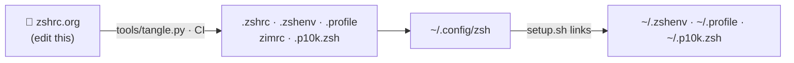

<h1 align="center">🦖 Rex Shell 2026</h1>
<p align="center"><b>Zim + Powerlevel10k, written as one Org file.</b><br>
Neon prompt · distro/CPU-aware segments · incognito history · optional-deps tolerant</p>

<p align="center">
  <a href="https://github.com/rexackermann/shell/actions/workflows/build.yml"></a>
  
  
  
  
  <a href="LICENSE"></a>
  
</p>

<p align="center"><code>{{VERSION}}</code> · {{LINES}} lines · {{BLOCKS}} code blocks · {{FUNCS}} functions · {{ALIASES}} aliases</p>

> GitHub's Org renderer is down at the moment, so this README is **generated from
> [`zshrc.org`](zshrc.org)** by CI on every push. The sections below are that file, collapsed.

## ⚡ Install

```bash
bash -c "$(curl -fsSL https://raw.githubusercontent.com/rexackermann/shell/main/setup.sh)"
```

Clones to `~/.config/zsh` and links `~/.zshenv`, `~/.profile` and `~/.p10k.zsh`.
Zim and Powerlevel10k install themselves on first start.

## 🧭 How it fits together



| Path | Purpose |
|---|---|
| [`zshrc.org`](zshrc.org) | Source of truth. Edit this. |
| `.zshrc` `.zshenv` `.profile` `zimrc` `.p10k.zsh` `home.zshenv` | Generated from the org file |
| [`tools/tangle.py`](tools/tangle.py) | Emacs-free tangler (`--check` runs `zsh -n`) |
| [`bin/`](bin) | Helper scripts, on `PATH` |
| [`setup.sh`](setup.sh) | Installer |
| [`archive/`](archive) | Previous org, installer and sync script |

## 📚 The config

Click a section to expand it.

